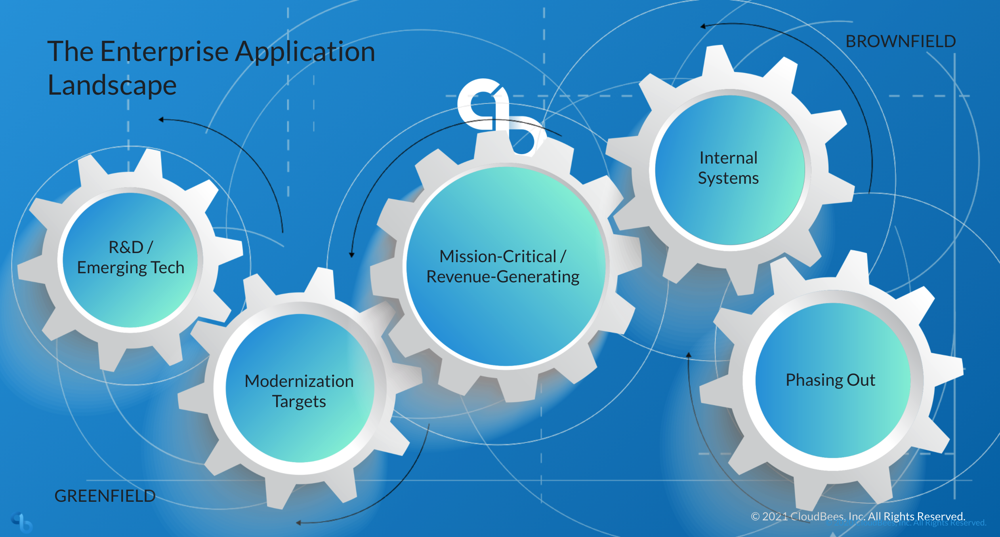

name: cloudbees product naming
# Cloudbees Product Naming

 ##  Cloudbees products have been renamed.

 - ElectricCloud ElectricFlow, now called Cloudbees CD/RO

 - Cloudbees EJC now called Cloudbees CI

 - All come together to make the SDA - Software Delivery Automation platform

---
layout: true

.header[
]

.footer[
- © 2020 CloudBees, Inc.
- 
]
---
name: cloudbees cd fundamentals
# Cloudbees CD/RO Fundamentals
- Overview of Release Orchestration
- Overview of Deployment Automation
- Cloudbees CD/RO Architecture Overview
 - Single Server Architecture
 - Clustered Server Architecture
---
layout: true

.header[
]

.footer[
- © 2020 CloudBees, Inc.
- 
]
---
name: enterprise landscape

