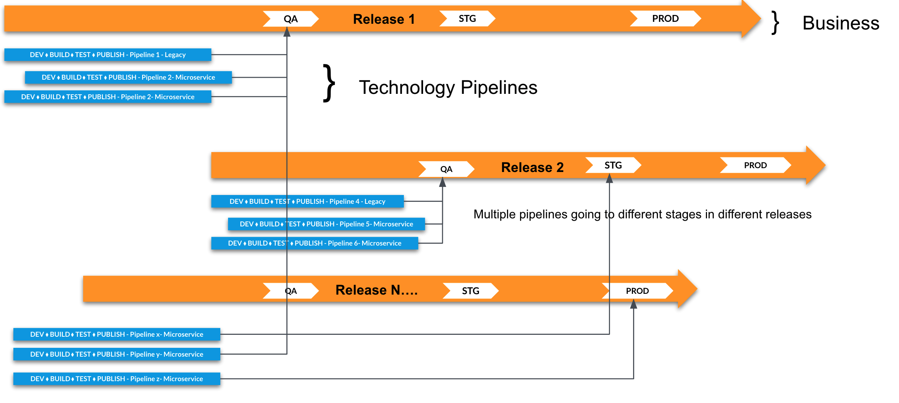
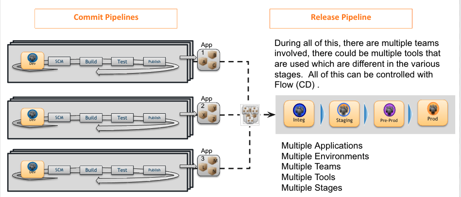

name: how releases tie together
# How releases tie everything together

---
layout: true

.header[
]

.footer[
]
---
name: overview of release process
# CD Fundamentals : Overview of the Release Process.

- Releases allow you to group together multiple applications and their Pipelines into a single entity for a targeted release.

- With CloudBees CD, you can schedule and track the progress of your release process, using the Dashboards and Calendaring functionality that you will learn about in this course.

- It is not just the deployment of one Application that you need to automate, control, and monitor. In reality, most Releases consist of more than just one Application, they are usually a combination of
various Applications that have interdependencies, and work together to make your business successful.

- So let’s take a look at how those Applications are bundled into a Release.
---
name: enterprise releases
# Enterprise Releases - Multiple Apps

---
name: commit pipelines
# Commit Pipelines and how they differ from Releases

They can span different technologies eg:
- Java, Python, .NET etc
They can involved multiple tiers
- Front -end eg :  Webserver
- Back-end eg : Engine
- Database
- Middle-tier systems eg: Business process engines
- Mainframe
- etc
---
name: more about releases
# Releases are all about the Business Process

Release Pipelines outline - The business process of the Enterprise to release software to production.
This business process could account for :
- Sign-offs
- Change Control Boards
- Audits
- Compliance
- Security
- Infrastructure/Operations
- etc
