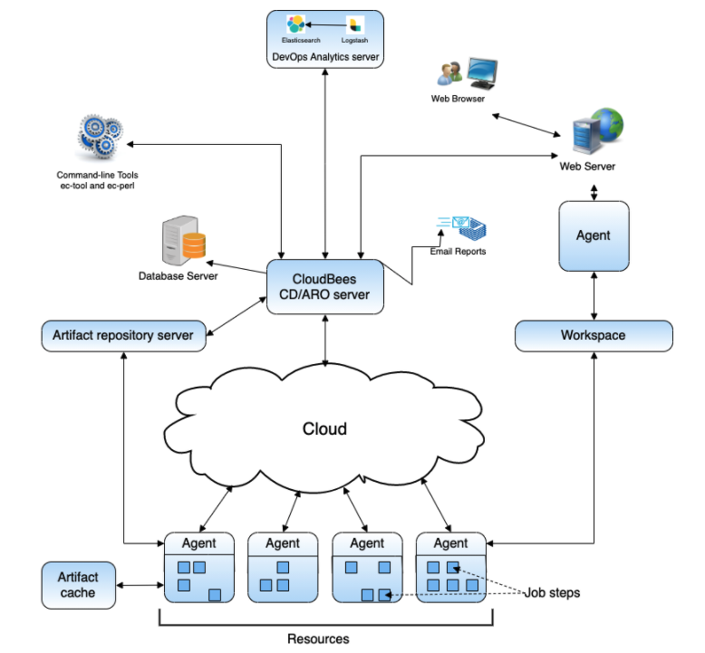

name: cloudbees cd architecture local_configuration
# CloudBees CD/RO Architecture - Local Configuration

- The CloudBees CD/RO server manages resources, issues commands, generates reports.
- An underlying database stores commands and metadata.
- Agents execute commands, monitor status, and collect results, in parallel across a cluster of servers for rapid throughput.
layout: true

.header[
]

.footer[
- © 2020 CloudBees, Inc.
- 
]
---
name: cloudbees cd architecture local_configuration pic
# CloudBees CD/RO Architecture - Local Configuration

