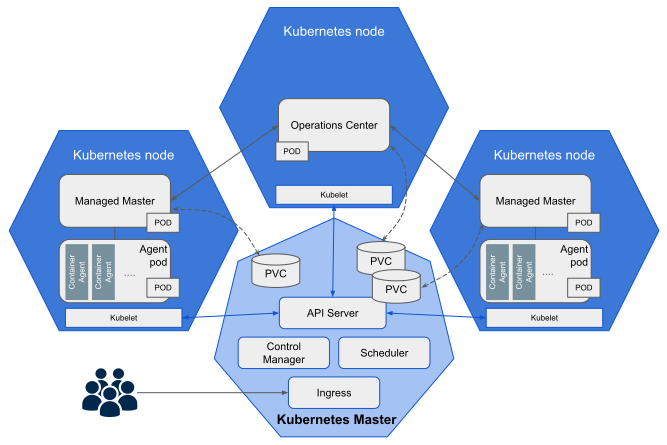

name: core-title-slide
class: title, shelf, no-footer, fullbleed
background-image: linear-gradient(135deg,#279be0,#036eb4)
count: false

# CloudBees CI Workshop
.one-third-up[]
???
This workshop introduces attendees to the features for CloudBees CI.

---
layout: true

.header[
]

.footer[
- © 2020 CloudBees, Inc.
- 
]
---
name: agenda
class: compact

# Agenda

1. <a class="no-style" href="#workshop-tools">Workshop Tools Overview</a>
2. <a class="no-style" href="#core-overview-title">CloudBees CI Overview</a>
3. <a class="no-style" href="#core-setup-overview">Setup for Labs</a>
4. <a class="no-style" href="#pipeline-template-catalog-title">Pipeline Manageability & Governance with Templates</a>
5. <a class="no-style" href="#casc-title">Configuration as Code (CasC) with CloudBees CI</a>
6. <a class="no-style" href="#pipeline-policies-title">Pipeline Manageability & Governance with Policies</a>
7. <a class="no-style" href="#dev-centric-title">A Developer Centric Experience</a>
8. <a class="no-style" href="#using-templates-title">Using Pipeline Templates</a>
9. <a class="no-style" href="#casc-dev-title">Configuration as Code (CasC) for Developers</a>
10. <a class="no-style" href="#contextual-feedback-title">Contextual Feedback for Pipelines</a>
11. <a class="no-style" href="#cross-team-title">Cross Team Collaboration</a>
12. <a class="no-style" href="#hibernate-title">Hibernating Managed Controllers</a>

.footnote[.bold[*] Please note, it is unlikely that we will get through all the material. However, all of the lab material is freely available on GitHub and can be self-led. The CloudBees CI lab environment will be available until next Monday if you would like to complete any labs we don't get through.]

---
name: workshop-tools
# Workshop Tools Overview

* We highly recommend using Google Chrome as the web browser - other browsers will work, but we have found Chrome to work best with the GitHub editor.
* We will be using Zoom breakout rooms for the majority of the workshop material.
* Please use the Zoom chat to introduce yourself and if you have any questions.
* We will have a short poll where you will be able to assess your experience level in a few technical areas. Based on your responses to the poll question you will be asked to rank your overall experience level as a **1**, **2** or a **3**, and then rename yourself in Zoom by adding that number before your name.
* After an overview of CloudBees CI you will be grouped by experience level into Zoom breakout rooms where you will complete the workshop.
* Once in the breakout rooms please feel free to ask questions via audio or via the Zoom chat. You may also use the Zoom *Nonverbal* feedback feature to raise your hand or to ask you instructor to slow down or speed up. NOTE: The chat is only broadcast to your breakout room.

---
name: workshop-zoom
class: center

---
name: lab-environment
# Lab Environment
* This workshop uses a CloudBees CI cluster, an enterprise version of Jenkins, running on the Google Kubernetes Engine (GKE)
  * Each attendee will have their own Jenkins instance provisioned as if you were a team. We refer to these as a ***managed controller*** since they are dynamical provisioned on Kubernetes and their full lifecycle is **managed** by the CloudBees CI Operations Center.
* All the instructions for the labs and these slides are publicly available
* Attendees will be using their own GitHub accounts 
* **IMPORTANT:** If you haven't already completed the *Pre-Workshop Setup* then do so here: https://cloudbees-ci.labs.cb-sa.io/getting-started/pre-workshop-setup/

---
name: core-overview-title
class: title, shelf, no-footer, fullbleed
background-image: linear-gradient(135deg,#279be0,#036eb4)
count: false

# CloudBees CI Overview

???
Notes

---
name: agenda-overview
class: compact

# Agenda

1. <a class="no-style" href="#workshop-tools">Workshop Tools Overview</a>
2. .blue-bold[CloudBees CI Overview]
3. <a class="no-style" href="#core-setup-overview">Setup for Labs</a>
4. <a class="no-style" href="#pipeline-template-catalog-title">Pipeline Manageability & Governance with Templates</a>
5. <a class="no-style" href="#casc-title">Configuration as Code (CasC) with CloudBees CI</a>
6. <a class="no-style" href="#pipeline-policies-title">Pipeline Manageability & Governance with Policies</a>
7. <a class="no-style" href="#dev-centric-title">A Developer Centric Experience</a>
8. <a class="no-style" href="#using-templates-title">Using Pipeline Templates</a>
9. <a class="no-style" href="#casc-dev-title">Configuration as Code (CasC) for Developers</a>
10. <a class="no-style" href="#contextual-feedback-title">Contextual Feedback for Pipelines</a>
11. <a class="no-style" href="#cross-team-title">Cross Team Collaboration</a>
12. <a class="no-style" href="#hibernate-title">Hibernating Managed Controllers</a>

---
name: core-overview-content

# Rapidly, Repeatedly, and Reliably Deliver Software

.italic[
  *Drive productivity and stability while accelerating time-to-market through automation of the software lifecycle.*
]

Increase Productivity
.no-bullet[
* Eliminate risk and delays due manual, error-prone hand-offs
]

Eliminate Silos
.no-bullet[
* Enable cross-functional collaboration by automating across teams and tools
]

Empower teams
.no-bullet[
* Enable freedom and experimentation by providing dedicated CD resources within a shared platform
]

Ensure Security and Compliance
.no-bullet[
* Drive best practices and standards across the organization with shared pipelines, gates, and continuous logging and metrics
]

---
name: cloudbees-ci-managed-controller

# CloudBees CI Enables Continuous Scaling

.img-left[
  .center[Managed Controller (Jenkins instance)]

]

.img-right[
* **Project Isolation**
  * DevOps project teams get their own Jenkins instance
  * Workloads are distributed across many Jenkins instances
  * Cross project contamination of workspaces and data is eliminated
* **Scalable Architecture**
  * Scaling and elasticity achieved through use of cluster managed containers 
* **Data Isolation**
  * Data contamination from previous executions are easily eliminated
]

???
CloudBees CI Managed Controller (Jenkins Instance)

---
name: core-k8s-architecture
class: middle, center

CloudBees CI on Kubernetes

???
They dynamic provisioning of a ***managed controller*** (team specific Jenkins instance) provided by CloudBees CI on Kubernetes makes it easy and quick to provide a centrally managed Jenkins instance for every team.
* **Less downtime:** Liveness and readiness for *managed controllers* and Operations Center thanks to Kubernetes Stateful Sets
* **Ephemeral agents:** Agents are deployed as containers via Kubernetes pods. They are created and destroyed during pipeline runs.
* **Kubernetes agent templates:** Templates can be defined for Kubernetes Pod based agents, shared with the whole cluster or defined at the team level.
Different Kubernetes clouds can be configured and shared from OC or at the individual team level, enabling hybrid and multi-cloud use cases.

---
name: core-overview-scale

# Manage Jenkins at Scale
* Curated and verified Jenkins plug-ins with **CloudBees Assurance Program** ensures you are using the most up-to-date and secure versions via monthly security and functionality releases 
* Configuration as Code for Jenkins and CloudBees CI commercial components
* Enables Comprehensive Jenkins Team Management including:
  * Easily provide *managed controllers* (Jenkins instance) per team
  * Centrally managed Role Based Access Control (RBAC)
  * Centralized and per team Credentials Management
  * Manage inbound events across multiple *managed controllers*
