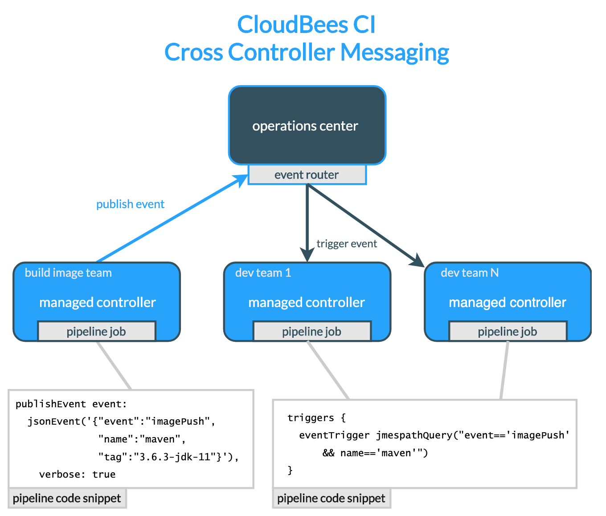

name: cross-team-title
class: title, shelf, no-footer, fullbleed
background-image: linear-gradient(135deg,#279be0,#036eb4)
count: false

# CloudBees CI<br>Cross Team Collaboration

---
name: agenda-templates
class: compact

# Agenda

1. <a class="no-style" href="#workshop-tools">Workshop Tools Overview</a>
2. <a class="no-style" href="#core-overview-title">CloudBees CI Overview</a>
3. <a class="no-style" href="#core-setup-overview">Setup for Labs</a>
4. <a class="no-style" href="#pipeline-template-catalog-title">Pipeline Manageability & Governance with Templates</a>
5. <a class="no-style" href="#casc-title">Configuration as Code (CasC) with CloudBees CI</a>
6. <a class="no-style" href="#pipeline-policies-title">Pipeline Manageability & Governance with Policies</a>
7. <a class="no-style" href="#rbac-casc-title">Delegating Administration with RBAC</a>
7. <a class="no-style" href="#dev-centric-title">A Developer Centric Experience</a>
8. <a class="no-style" href="#using-templates-title">Using Pipeline Templates</a>
9. <a class="no-style" href="#casc-dev-title">Configuration as Code (CasC) for Developers</a>
10. <a class="no-style" href="#contextual-feedback-title">Contextual Feedback for Pipelines</a>
11. .blue-bold[Cross Team Collaboration]
12. <a class="no-style" href="#hibernate-title">Hibernating Managed Controllers</a>

---
name: cross-team overview
class: center



---
name: cross-team-publish-types

# Publish Event Types for Cross Team Collaboration

There are two types of events that can be published for the `publishEvent` step:
* **`simpleEvent`** - a publish event type that only allows including a single string as the event payload. The supplied string value will be dynamically *wrapped* as the value of the `event` JSON key.

```groovy
publishEvent simpleEvent('helloWorld')
```

* **`jsonEvent`** - a more complex publish event type, it allows you to specify any valid JSON as the event payload.

```groovy
publishEvent event: jsonEvent('{"event":"imagePush","name":"node","tag":"14.0.0-alpine3.11"}')
```

---
name: cross-team-trigger-types

# Event Trigger Types for Cross Team Collaboration

Just as there are two types of publish events, there are also two corresponding `eventTrigger` types:
* **`simpleMatch`** - this `eventTrigger` type is used for events that are published as a `simpleEvent` and will only match against simple strings.

```groovy
pipeline {
    agent any
    triggers {
*       eventTrigger simpleMatch("helloWorld")
    }
...
```

* **`jmespathQuery`** - this `eventTrigger` allows the use of complex queries against JSON event payloads.

```groovy
pipeline {
  agent none
  triggers {
*   eventTrigger jmespathQuery("event=='imagePush' && name=='node'")
  }
```

---
name: collab-lab
class: compact

# Lab - Triggering Pipelines with Cross Team Collaboration

* In this lab we will use CloudBees CI cross team collaboration by adding an event trigger listener so that when the job for our build image is complete, it will kick off the template job for the `simple-java-maven-app` application with an event payload that includes the information for the `maven` image to use.
* First, to figure out what we're dealing with, let's look at the part of the `Dockerfile` for the `simple-java-maven-app` application. By default, it will use the `maven:3-openjdk-8` image:

```Dockerfile
ARG BUILD_IMAGE=maven:3-openjdk-8
...
```
  * The **Maven Pipeline Template** (and supporting Pipeline Shared Library) will be updated to override the `BUILD_IMAGE` argument with a value from the payload of a published event.
* The *Triggering Pipelines with Cross Team Collaboration* lab instructions are available at: 
  * https://cloudbees-ci.labs.cb-sa.io/module-2/cross-team-collaboration/


---
name: collab-lab-overview

# Cross Team Collaboration Lab Overview

* Enabled **Notifications** for CloudBees Cross Team Collaboration on your ***managed controller***
* Updated the **Maven Pipeline Template** of your Pipeline Template Catalog with an event trigger
* Created a Pipeline job that publishes an event to trigger the jobs based on the **Maven Pipeline Template**