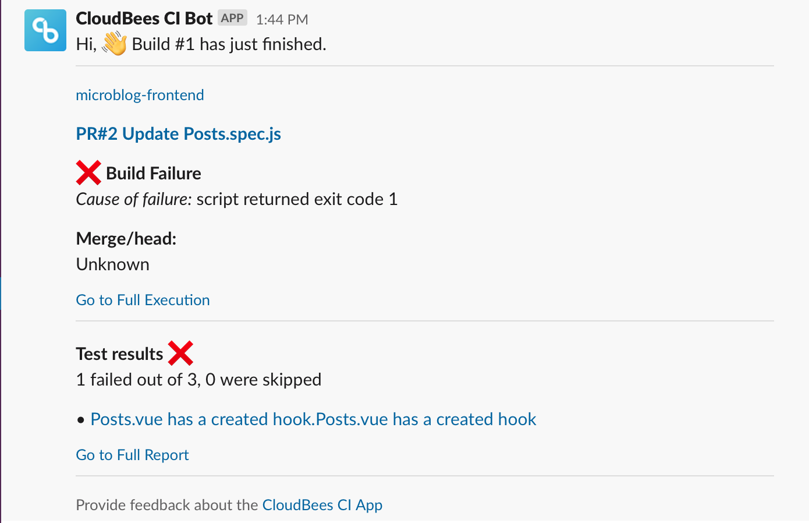

name: contextual-feedback-title
class: title, shelf, no-footer, fullbleed
background-image: linear-gradient(135deg,#279be0,#036eb4)
count: false

# CloudBees CI Contextual Feedback for Pipelines

---
name: agenda-setup
# Agenda

1. Workshop Tools Overview
2. CloudBees CI Overview
3. Setup for Labs
4. Pipeline Manageability & Governance with Templates
5. Configuration as Code (CasC) with CloudBees CI
6. Pipeline Manageability & Governance with Policies
7. Configuration as Code (CasC) for Developers
8. .blue-bold[Contextual Feedback for Pipelines]
9. Cross Team Collaboration
10. Hibernating Managed Controllers

---
name: contextual-feedback-overview
class: compact

### CloudBees SCM Reporting for GitHub 

* The CloudBees SCM Reporting plugin supports detailed commit statuses for GitHub and BitBucket.
* As the build runs, CloudBees CI will surface actionable build information directly in GitHub, in real-time, alleviating the need to switch over to your CloudBees CI managed controller to get an overview.

#### GitHub App Credential
Using the GitHub App credential type with the CloudBees SCM Reporting plugin offers the following additional benefits:
* Larger rate limits - The rate limit for a GitHub app scales with your organization size, whereas a user based token has a limit of 5000 regardless of how many repositories you have.
* User-independent authentication - Each GitHub app has its own user-independent authentication. No more need for 'bot' users or figuring out who should be the owner of 2FA or OAuth tokens.
* Improved security and tighter permissions - GitHub Apps offer much finer-grained permissions compared to a service user and its personal access tokens. This lets the Jenkins GitHub app require a much smaller set of privileges to run properly.
* GitHub Checks API - allows the CloudBees SCM Reporting plugin to leverage the GitHub Checks API to create check runs and check suites from Jenkins jobs and provide detailed feedback on commits as well as detailed code annotations.

---
name: pipeline-template-catalog-slack

# CloudBees Slack Plugin 

.img-left[

]

.img-right[
* Similar to the CloudBees SCM Reporting plugin, the CloudBees Slack plugin provides actionable build information as Slack messages.
* After a build runs, the CloudBees Slack plugin will surface results about the build directly in Slack, alleviating the need to switch over to your CloudBees CI managed controller (Jenkins instance) to get an overview.
* The Slack messages are sent directly to individual users based on who committed the code that triggered the CloudBees CI job.
]

---
name: contextual-feedback-lab-link
class: compact

# Lab - Configuring and Interacting with Contextual Feedback

* In the following lab you will configure and interact with contextual Pipeline feedback for GitHub and Slack.
* The *Configuring and Interacting with Contextual Feedback* lab instructions are available at: 
  * https://cloudbees-ci.labs.cb-sa.io/module-2/contextual-pipeline-feedback/