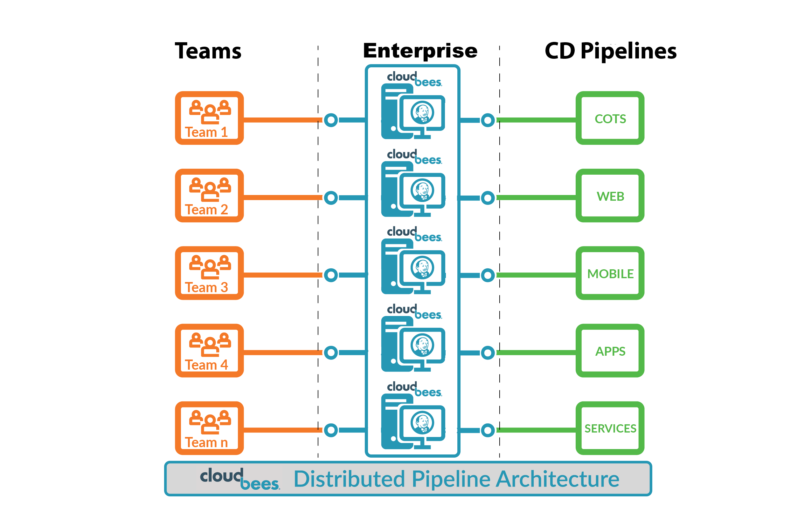

name: core-title-slide
class: title, shelf, no-footer, fullbleed
background-image: linear-gradient(135deg,#279be0,#036eb4)
count: false

# CloudBees Core Workshop
.one-third-up[]
???
This workshop introduces attendees to the features for CloudBees Core.

---
layout: true

.header[
]

.footer[
- © 2020 CloudBees, Inc.
- 
]
---
name: agenda
# Agenda

1. Workshop Tools Overview
2. CloudBees Core Overview
3. Setup for Labs
4. Configuration as Code (CasC) with CloudBees Core
5. Pipeline Manageability & Governance with Templates and Policies
6. Cross Team Collaboration
7. Hibernating Masters

---
name: workshop-tools
# Workshop Tools Overview

* We will be using Zoom breakout rooms for the majority of the workshop material.
* Please use the Zoom chat to introduce yourself and if you have any questions.
* We will have a short poll where you will be able to assess your experience level in a few technical areas. Based on your responses to the poll questions you will be asked to rank your overall experience level as a **1**, **2** or a **3**, and then rename yourself in Zoom by adding that number before your name.
* After an overview of CloudBees Core you will grouped by experience level into Zoom breakout rooms.
* Once in the breakout rooms please feel free to ask questions via audio or via the Zoom chat. You may also use the Zoom *Nonverbal* feedback feature to raise your hand or to ask you instructor to slow down or speed up. NOTE: The chat is only broadcast to your breakout room.

---
name: workshop-zoom

---
name: lab-environment
# Lab Environment
* This workshop uses a CloudBees Core cluster, an enterprise version of Jenkins, running on the Google Kubernetes Engine (GKE)
  * Each attendee will provision their own Jenkins instance for the labs by leveraging the scalability of CloudBees Core on Kubernetes
* All the instructions for the labs and these slides are publicly available in GitHub
* Attendees will be using their own GitHub accounts 

---
name: core-overview-title
class: title, shelf, no-footer, fullbleed
background-image: linear-gradient(135deg,#279be0,#036eb4)
count: false

# CloudBees Core Overview

???
Notes

---
name: core-overview-content
class: compact

# Rapidly, Repeatedly, and Reliably Deliver Software

.italic[
  *Drive productivity and stability while accelerating time-to-market through automation of the software lifecycle.*
]

Increase Productivity
.no-bullet[
* Eliminate risk and delays due manual, error-prone hand-offs
]

Eliminate Silos
.no-bullet[
* Enable cross-functional collaboration by automating across teams and tools
]

Empower teams
.no-bullet[
* Enable freedom and experimentation by providing dedicated CD resources within a shared platform
]

Ensure Security and Compliance
.no-bullet[
* Drive best practices and standards across the organization with shared pipelines, gates, and continuous logging and metrics
]

---
name: core-team-masters

# CloudBees Core Enables Continuous Scaling

.img-left[
  .center[Team Masters]

]

.img-right[
* Project Isolation
  * DevOps project teams get their own Jenkins Master
  * Distributes workload across masters
  * Cross project contamination of workspaces and data is eliminated
* Scalable Architecture
  * Scaling and elasticity achieved through use of cluster managed containers 
* Data Isolation
  * Data contamination from previous executions are easily eliminated
]

???
Team Masters

---
name: core-k8s-architecture
class: middle, center

CloudBees Core on Kubernetes

???
They dynamic provisioning of Masters provided by CB Core on K8s makes it easy to provide a Jenkins instance for every team.
* **Less downtime:** Liveness and readiness for Masters and Operations Center thanks to Kubernetes Stateful Sets
* **Ephemeral agents:** Agents are containers deployed on a K8s pod. They are created and destroyed during pipeline run
* **Kubernetes agent templates:** Templates can be defined for K8s Pod based agents, shared with the whole cluster or defined at the team level.
Different K8s clouds can be configured and shared from OC or at the individual team level.

---
name: core-overview-scale

# Manage Jenkins at Scale
* Curated and verified Jenkins plug-ins with **CloudBees Assurance Program** ensures you are using the most up-to-date and secure versions via monthly security and functionality releases 
* Configuration as Code for Jenkins and Core commercial components
* Enables Comprehensive Jenkins Team Management including:
  * Masters per Team
  * Centrally managed Role Based Access Control (RBAC)
  * Centralized and per team Credentials Management
  * Manage inbound events across multiple Masters
