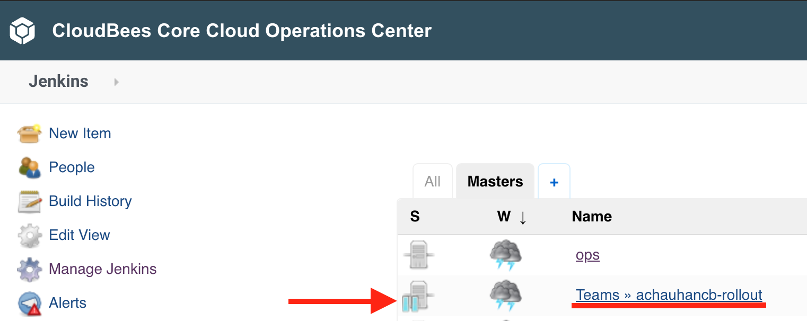

name: core-hibernate-title
class: title, shelf, no-footer, fullbleed
background-image: linear-gradient(135deg,#279be0,#036eb4)
count: false

# CloudBees Core Hibernating Masters

---
name: agenda-templates
# Agenda

1. Workshop Tools Overview
2. CloudBees Core Overview
3. Setup for Labs
4. Configuration as Code (CasC) with CloudBees Core
5. Pipeline Manageability & Governance with Templates and Policies
6. Cross Team Collaboration
7. .blue-bold[Hibernating Masters]

---
name: hibernate-overview

# CloudBees Core Hibernating Masters .badge-red[PREVIEW]

* [CloudBees Core Managed Master hibernation](https://docs.cloudbees.com/docs/cloudbees-core/latest/cloud-admin-guide/managing-masters#_hibernation_in_managed_masters) takes advantage of running Core on Kubernetes by automatically shutting down or hibernating Team/Managed Masters. This is done by scaling the Kubernetes StatefulSet down to zero replicas.
* Hibernation was enabled for everyones' Team Master earlier in the CasC lab and everyones' Team Masters will hibernate after 30 minutes of inactivity.
* Filtered web activity and direct web access will **wake up** the Team Master. If a Team Master is hibernating - signified by the **pause** icon next to it in the classic UI of Operations Center, all you need to do is click on it and it will be up and running in a few minutes.

???
The workshop clusters will continue to be available for both Core and Rollout for the rest of the week of CB Connect. We need to make sure that all Core attendees are aware that their Team Master will most likely be hibernating when they come back to complete any labs and that they just need to click on it to ‘wake it up’ from the classic UI of OC.

---
name: hibernate-screenshot
class: center

---
name: hibernating-masters-cost-saving

# How Hibernating Masters Reduce Infrastructure Costs

There are several ways that costs may be reduced with Managed Master hibernation:

1. When using Kubernetes auto-scaling and a Managed Master is hibernated then the Kubernetes cluster has the potential to downscale by removing a node.
2. When a Managed Master is hibernated you immediately gain additional CPU and memory on the node where your Team/Managed Master pod was running - this additional capacity is immediately available for Kubernetes based agents reducing the possibility of agents queueing and/or triggering an upscaling of your Kubernetes cluster. 

---

# Lab - Configuring Webhooks for Hibernating Masters

* The *Configuring Webhooks for Hibernating Masters* lab instructions are available at: 
  * [https://github.com/cloudbees-days/core-rollout-flow-workshop/blob/master/labs/hibernating-masters/hibernating-masters.md](https://github.com/cloudbees-days/core-rollout-flow-workshop/blob/master/labs/hibernating-masters/hibernating-masters.md)

???

All presenters should familiarize themselves with the hibernation monitor design document: https://github.com/cloudbees/managed-master-hibernation-monitor/blob/master/design.md 