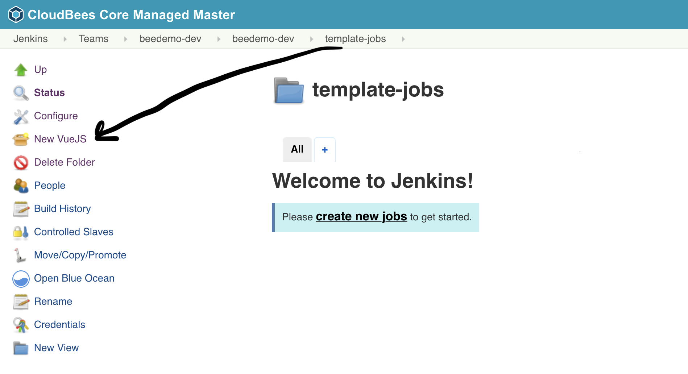

#  CloudBees CI - Pipeline Template Catalogs

[Instructor led video of lab.](https://youtu.be/YBoX-bE3YYQ)

## Import Pipeline Template Catalog
1. Navigate to the top-level of your Team (Jenkins instance) and click on **Pipeline Template Catalogs** in the left menu

2. Click on **Add catalog**

3. Fill out the **Catalog source control options**:
   1. **Branch or tag for this template catalog**: master
   2. Select **GitHub** under **Catalog source code repository location**
   3. **Credentials**: select the *username/password* credential you created for the CloudBees CI workshop - it will show up as - `[GitHub username]/****** (GitHub PAT from JCasC - username/password)`
   4. **Repository HTTPS URL**: The GitHub URL for your forked copy of the **pipeline-template-catalog** repository. In the example below the GitHub Organization being used is **bee-cd** so the *repository URL* would be `https://github.com/bee-cd/pipeline-template-catalog.git`. **NOTE:** You need to use the repository URL for the GitHub Organization you created for this workshop in the CloudBees CI workshop setup lab - so `bee-cd` would be replaced with your GitHub Organization.
   5. Next, click the **Validate** button to ensure your credentials and repository URL are set correctly. If the validation fails, please check that you selected the correct GitHub credentials and that the **Repository HTTPS URL** points to the fork of the **pipeline-template-catalog** repository in the GitHub Organization that you created for this workhsop.
   6. Finally, click the **Save** button 

4. Once the import is complete, click on the **CloudBees Days Workshop Catalog** link. 

5. The Pipeline Template Catalog you imported will have 4 templates to include the **VueJS** template which we will be using next. 

6. On your Team (Jenkins instance) navigate to the folder with the same name as your Team (Jenkins instance) (you should see the `workshop-setup` Pipeline job) and then click on the **New Item** link in the left menu

7. For the **item name** enter ***template-jobs***, select **Folder** and then click the **OK** button. 

8.  Scroll to the bottom of the folder configuration and click on **Restrict the kind of children in this folder** - a [CloudBees Folders Plus](https://docs.cloudbees.com/docs/cloudbees-core/latest/cloud-secure-guide/folders-plus) feature - and then select **VueJS** and then hit the **Save** button. 

   
## Create vue.js Job from Pipeline Template Catalog
In this lab you will create a new Multibranch Pipeline job from the **VueJS** template provided by the Pipeline Template Catalog you added above - just by filling in a few parameters.

1. On your Team (Jenkins instance) navigate into the **template-jobs** folder that you created in the previous lab.
2. Click on the ***New VueJS*** link in the left menu. 

3. **Enter an item name** as ***[GitHub username]-frontend***, select **VueJS**  and click the **OK** button. 

4. Fill out the template parameters:
   1. **Repository Owner**: the GitHub Organization your created for the CloudBees CI workshop
   2. **Repository**: The name of your forked repository, *microblog-frontend*
   3. **GitHub Credential ID**: select the *username/password* credential created for you by the **workshop-setup** job and CloudBees CI CasC - it will show up as - [GitHub username]/******
   4. Click the **Save** button

5. After the initial scan you will see one Jenkins Pipeline job funder the **Pull Requests** tab of the Pipeline Mulitbranch project that was just created for your fork of the **microblog-frontend** repository - **PR-1**. 

6. Now, in **GitHub**, navigate to the **Add marker file** pull request (#1) in your fork of the **microblog-frontend** repository. 

7. Click on the pull request, scroll down to the pull request checks and you will see the stage level status of the Pipeline. Here you see that the **VueJS Tests** `stage` has started. 

8. Once the Pipeline finishes you will see that all the checks failed on the pull request in GitHub. Clicking on the **Details** link of the **ci/cloudbees/error** check will take you directly to the build logs with the error in your Team (Jenkins instance). 

9. The logs show us that a test in `tests/unit/Posts.spec.js` failed - a typo where the word **function** was mis-typed as **funcion**. 

10. In GitHub, navigate back to the **Add marker file** pull request for your forked **microblog-frontend** repository, click on the **Files changed** tab and then click on the context menu for the `tests/unit/Posts.spec.js` file and select **Edit file**. 

11. In the GitHub editor for the `tests/unit/Posts.spec.js` file fix the typo changing **funcion** to **function**, and then click the **Commit changes** button to commit the changes to the **marker-file** branch of your forked **microblog-frontend** repository. 

12. Finally, on the pull request page for your **Add marker file** pull request click on the **Conversation** tab and scroll down to the pull request checks. After the **PR-1** pipeline job completes you will see that all the checks are now successful, scroll to the bottom and click the green **Merge pull request** button and then the **Confirm merge** button to merge the pull request to your **master** branch.

**For instructor led workshops please returns to the [workshop slides](https://cloudbees-days.github.io/core-rollout-flow-workshop/core/#31).**

Otherwise, you may proceed to the next lab: [*CloudBees Pipeline Policies*](../pipeline-policies/pipeline-policies.md) or choose another lab on the [main page](../../README.md#workshop-labs).
