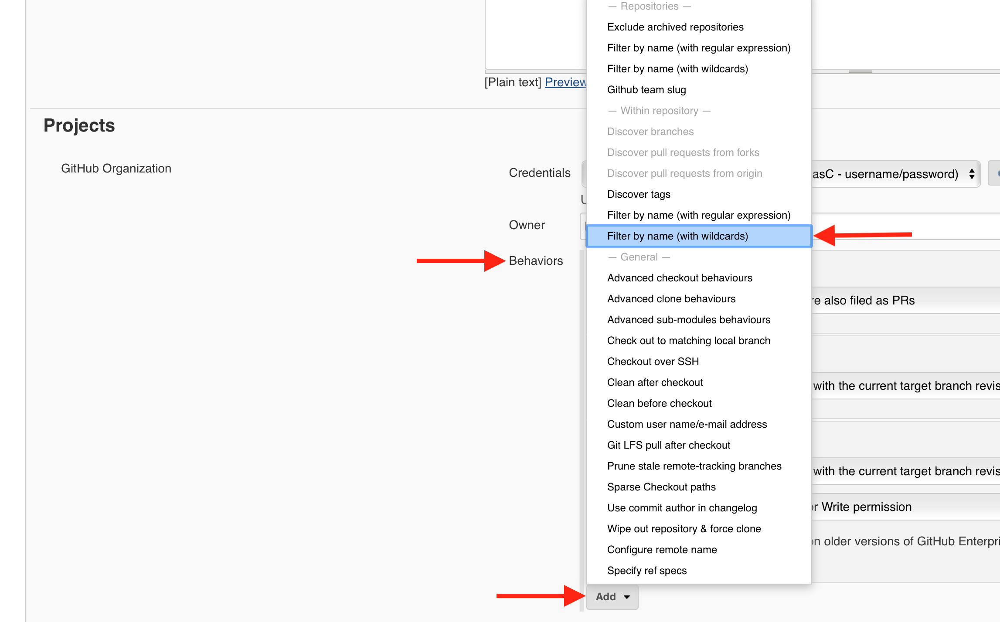
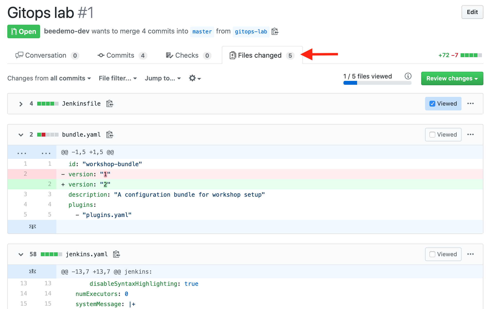
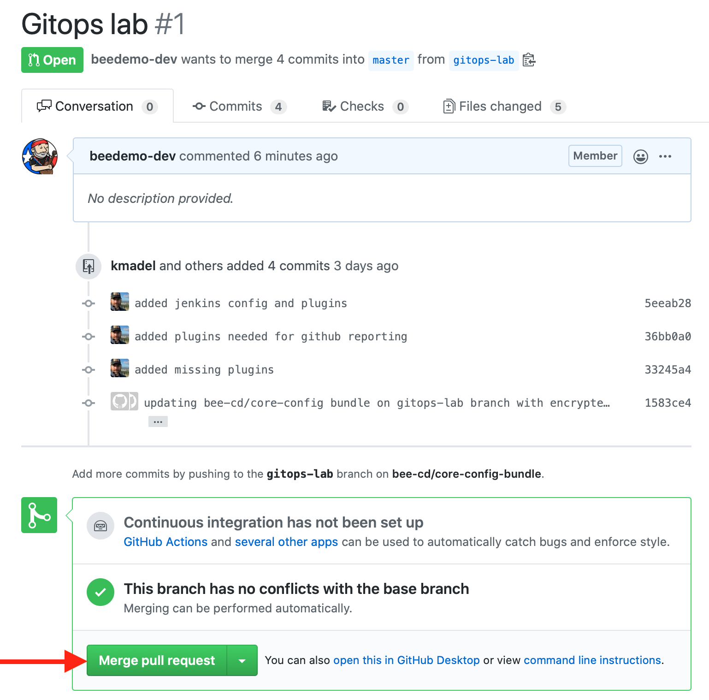
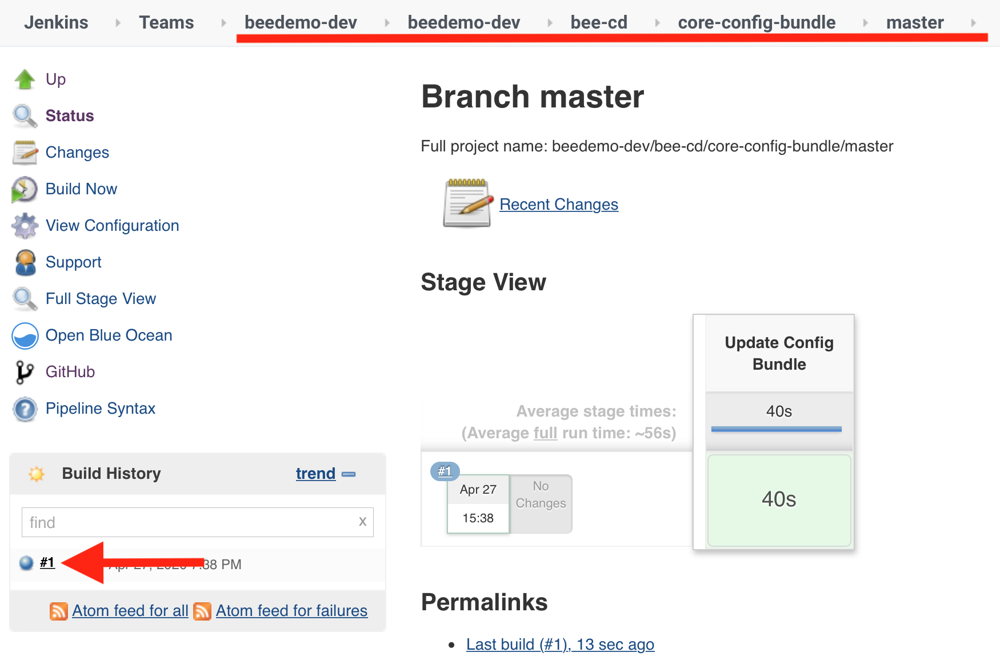

#  CloudBees Core - GitOps for Core CasC

In this lab we will setup [GitOps](https://www.gitops.tech/) for [Configuration as Code (CasC) for CloudBees Core](https://docs.cloudbees.com/docs/cloudbees-core/latest/cloud-admin-guide/core-casc-modern) so that any Jenkins configuration changes you make in source control will automatically be updated in your Core Team Master. 

[Instructor led video of lab.](https://youtu.be/P-_xHx3db2k)

* You will create a Jenkins Pipeline job on your Team Master to automatically update the Core configuration bundle for your Team Master.
* You will add some new configuration to the Core configuration bundle in your forked **core-config-bundle** repository and then commit the changes to the **master** branch of your **core-config-bundle** repository that will in turn tigger a Jenkins Pipeline to update your Core configuration bundle.

1. If you are in the Blue Ocean UI, switch to the classic UI by clicking on the ***Go to classic*** button next to the ***Logout*** button in Blue Ocean navigation bar.

2. Once in the classic UI on your Team Master, ensure that you are in the folder with the same name as your Team Master - you should see the `core-workshop-setup` and `rollout-workshop-setup` Pipeline jobs. This is important if you want to use Blue Ocean to visualize the Pipeline runs of Pipeline jobs you add to your Team Master, because only jobs under this folder will show up in Blue Ocean.

3. Click on the **New Item** link in the left navigation menu - again, make sure that you are in the **folder** with the same name as your Team Master, and not at the root of your Team Master.
4. Enter the name of the GitHub Organization you created for this workshop as the **Item Name**, select **GitHub Organization** as the item type and then click the **OK** button.

5. On the next screen, select the **Credentials** with the ***GitHub PAT from JCasC - username/password*** description and displaying your GitHub username - this credential was created with the Core CasC bundle applied to your Team Master by the **core-workshop-setup** job.
6. The value of the **Owner** field is already filled in and matching the **Item Name** you entered above - ensure that it matches the name of the GitHub Organization you created for this workshop.
7. Next, under the **Behaviors** section, click the **Add** button, select **Filter by name (with wildcards)** under **- Within repository -** and then enter ***master*** as an **Include** so that will be the only branch that gets scanned and built. **IMPORTANT** - make sure you select the **Filter by name (with wildcards)** option **UNDERNEATH** the **- Within repository -** section of the **Behaviors** select list. 

8. Click the **Build strategies** **Add** button and select ***Skip initial build on first branch indexing*** from the drop-down. 
9. Finally, click the **Save** button.

10. After you click the **Save** button the Organization Folder Pipeline project will scan every branch of every repository of your GitHub Organization creating a Pipeline job for each branch where there is a `Jenkinsfile` (or in this case, just the **master** branch) and creating a [Pipeline Multibranch project](https://jenkins.io/doc/book/pipeline/multibranch/#creating-a-multibranch-pipeline) for each repository where there is at least one branch containing a `Jenkinsfile`. Once the scan is complete, click on the breadcrumb link that matches your GitHub Organization name - just to the left of **Scan Organization**.

11. Click on the link of the Jenkins Multibranch Pipeline project for your fork of the **core-config-bundle** repository.

12. Next, navigate to your fork of the **core-config-bundle** repository on GitHub by clicking on the **GitHub** link in the left navigation menu. 

13. In GitHub, click on the **Pull requests** tab and then click on the **GitOps lab updates** pull request. 

14. To quickly review the changes that will be made to your Core configuration bundle for your Team Master, click on the **Files changed** tab and scroll down to see the differences. 

15. Once you have reviewed the changes, click back on the **Conversation** tab and then click the green **Merge pull request** button and then the **Confirm merge** button. 

16. Now navigate to the **master** branch Pipeline job of the **core-config-bundle** Multibranch Pipeline project on your Team Master. 

17. As the job to update your Core CasC bundle is running, let's explore the configuration changes in more detail. Navigate back to your fork of the **core-config-bundle** repository on GitHub and open the `jenkins.yaml` file.
18. Shortly after the Pipeline job completes you will see a new **monitor** warning. Click on the **monitor** link of your Team Master and you will see that a new version of the configuration bundle is available - click on the **Reload Configuration** button and on the next screen click the **Yes** button to apply the updated configuration bundle. 

19. Among other configuration changes, you will now see a link for **Pipeline Polices** in the left navigation menu, an updated system message and [Core Master Hibernation](https://docs.cloudbees.com/docs/cloudbees-core/latest/cloud-admin-guide/managing-masters#_hibernation_in_managed_masters) has been configured for your Team Master. 

>NOTE: The **Build strategies** configuration for Pipeline Organization Folder and Multibranch projects are provided by the [Basic Branch Build Strategies plugin](https://github.com/jenkinsci/basic-branch-build-strategies-plugin/blob/master/docs/user.adoc) and by selecting the *Skip initial build on first branch indexing* strategy we avoid an unnecessary build when we first create the Organization Folder project above.

**For instructor led workshops please returns to the [workshop slides](https://cloudbees-days.github.io/core-rollout-flow-workshop/core/#26)**

Otherwise, you may proceed to the next lab: [*Pipeline Template Catalogs*](../pipeline-template-catalog/pipeline-template-catalog.md) or choose another lab on the [main page](../../README.md#workshop-labs).
