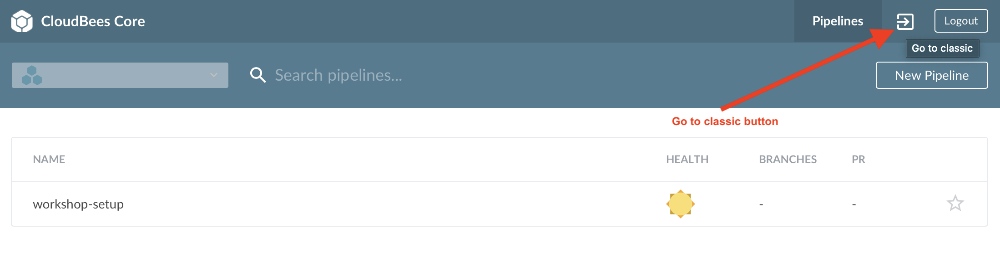
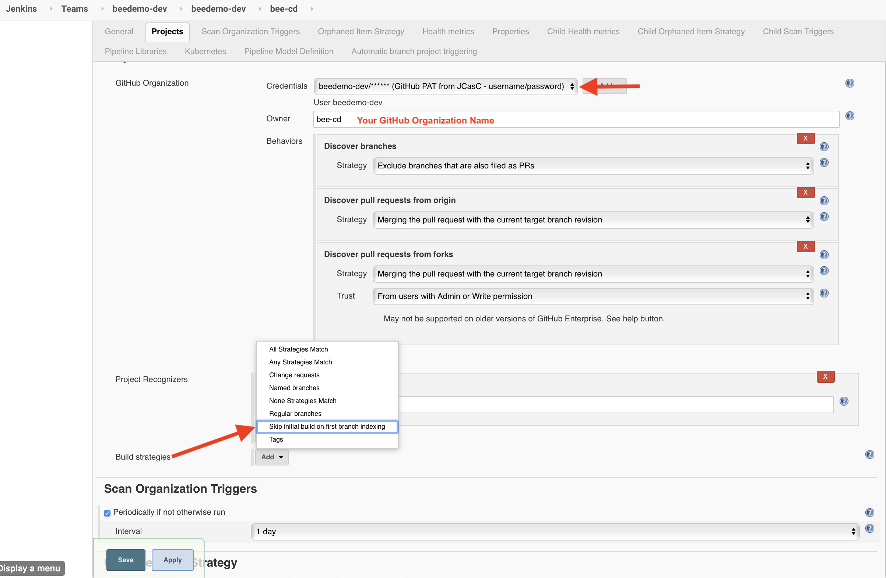
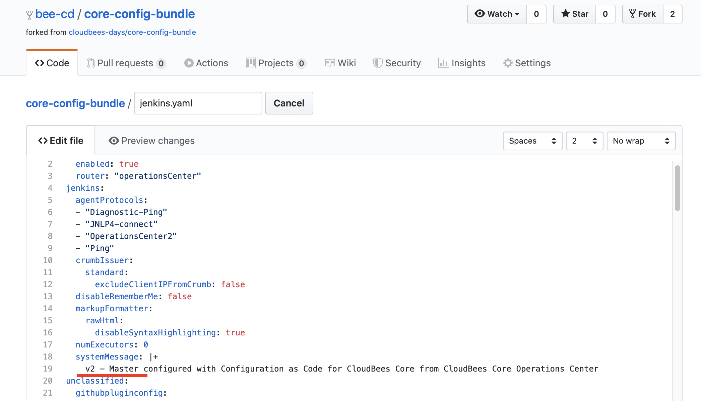

#  CloudBees Core - Configuration as Code

In this lab we are going to explore [Configuration as Code (CasC) for CloudBees Core](https://docs.cloudbees.com/docs/cloudbees-core/latest/cloud-admin-guide/core-casc-modern) and then we will setup [GitOps](https://www.gitops.tech/) for Core CasC so that any Jenkins configuration changes you make in source control will automatically be updated in your Core Team Master. 

CasC for CloudBees Core consists of a collection of YAML files referred to as a configuration bundle (or CasC bundle) that includes four files:

1. `bundle.yaml` - This file is an index file that describes the bundle, and references the other files in the bundle.
2. `jenkins.yaml` - This file contains the Jenkins configuration as defined by the OSS [Jenkins CasC plugin](https://github.com/jenkinsci/configuration-as-code-plugin).
3. `plugin-catalog.yaml` - This file provides a list of plugins that are not already part of the Core plugin envelope and makes those plugins available to be installed on a Managed Master.
4. `plugins.yaml` - This file contains a list of all plugin to be installed on a Managed Master by the Core CasC capability.

## Enabling CasC for a Core Managed/Team Master

The `workshop-setup` job modified the `jenkins.yaml` file with `sed` and then copied the Core configuration bundle YAML files from your forked **core-config-bundle** repository to a sub-directory with the same name as your Team Master inside a special directory - the `jcasc-bundles-store` directory - in the Jenkins home of the Core Operations Center from which you created your Team Master. Your Team Master then had to be re-provisioned for the Core configuration bundle to take effect.

When the Core Operations Center is provisioning a Team/Managed Master it will check to see if there is a matching configuration for the name of the Team/Managed Master being provisioned and copy that Core configuration bundle link YAML file to `/var/casc-bundle/bundle-link.yaml` on your Team Master and set the value of the `core.casc.config.bundle` system property to match that file path. 

Your Team Master will then use that protected link to download the Core configuration bundle to your Team Master. The `jenkins.yaml` file will be downloaded from the OC to `/var/jenkins_home/core-casc-bundle/jenkins.yaml` and the `casc.jenkins.config` system property will be set to that file path.

## Configuration Bundle Components

### jenkins.yaml
The `jenkins.yaml` provides all of the Jenkins system and plugin configuration - that is currently supported and primarily relies on the [OSS Jenkins Configuration as Code (JCasC) plugin](https://github.com/jenkinsci/configuration-as-code-plugin) for the OSS system and plugin configuration that is supported. Also note that some, but not all, CloudBees Core plugins support JCasC based configuration.

#### Credentials
Core CasC was used to create two user specific Jenkins credentials for use in the rest of this workshop.

[JCasC Secrets](https://github.com/jenkinsci/configuration-as-code-plugin/blob/master/docs/features/secrets.adoc) for credentials can be managed in a few different ways:
  1. As properties files in the Jenkins Master file system. For secrets that you want to share across Team Masters you can mount the same [Kubernetes Secret](https://kubernetes.io/docs/concepts/configuration/secret/) to every Master.
  2. As Jenkins encrypted values using the Jenkins-internal secret key allowing the encrypted strings to be used directly in the  `jenkins.yaml` configuration as we are doing in this workshop. The Jenkins-internal secret key used for encryption is unique for to Jenkins instance and means that the credentials are not portable between Team Masters.

The `workshop-setup` job used Jenkins to encrypt the GitHub Personal Access Token that you provided so it can only be decrypted by your Team Master and then replaced the `REPLACE_WITH_JENKINS_ENCODED_PAT`placeholders in your copy of the `jenkins.yaml` file with the Jenkins encrypted value of your GitHub Personal Access Token. Other placeholders that were replaced were: `REPLACE_GITHUB_ORG` with the GitHub Organization your created for the workshop and `REPLACE_WITH_YOUR_GITHUB_USERNAME` with the GitHub username you are using for this workshop. 

#### Pipeline Shared Library
CasC allows auto-configuring Pipeline Shared Libraries so it is very easy to provide the same Pipeline Shared Libraries across multiple teams as we have done in this workshop. The Core Pipeline Shared Library was configured at the global level so that it will be available to all the Jenkins Pipeline that you run on your Team Master.

#### Master Level Kubernetes Agent Templates
The CloudBees Kube Management plugin allows you to [configure Kubernetes Pod Templates for agents at the Team/Master level](https://docs.cloudbees.com/docs/cloudbees-core/latest/cloud-admin-guide/agents#_editing_pod_templates_per_team_using_masters) but still managed the Kubernetes cluster configuration for Kuberentes based agents at the Core Operations Center level. Several Kubernetes Pod Templates were added to your Team Master via your Core configuration bundle.

## GitOps for Core CasC
One of the main reasons to manage configurations as code is to allow it to be managed in source control. But you still don't want to have to execute any manual steps when you make approved changes to your configuration. In this exercise we will setup a Jenkins Pipeline job - a [Pipeline Organization Folder](https://jenkins.io/doc/book/pipeline/multibranch/#organization-folders) - on your Team Master that will be triggered whenever you commit any approved changes to the **master** branch of the Core configuration bundle repository.

* You will create a Jenkins Pipeline job on your Team Master to automatically update the Core configuration bundle for your Team Master.
* You will add some new configuration to the `jenkins.yaml` JCasC configuration in your **core-config-bundle** repository and commit the changes to the **master** branch of your **core-config-bundle** repository that will then tigger the Jenkins Pipeline to update your Core configuration bundle.

1. If you are in the Blue Ocean UI then switch to the classic UI by clicking on the ***Go to classic*** button next to the ***Logout*** button in Blue Ocean navigation bar.<p>
2. Once in the classic UI on your Team Master, ensure that you are in the folder with the same name as your Team Master - you should see the `workshop-setup` Pipeline job. This is important if you want to use Blue Ocean to visualize the Pipeline runs, because only jobs under this folder will show up in Blue Ocean.<p>
3. Click on **New Item** link in the left navigation menu - make sure that you are in the folder with the same name as your team, and not at the root of your Team Master.
4. Enter the name of the GitHub Organization you created for this workshop as the **Item Name**, select **GitHub Organization** as the item type and then click the **OK** button.<p>
5. Select the **Credentials** with the ***GitHub PAT from JCasC - username/password*** description created for you with Core CasC, note the value of the **Owner** field is already filled in and matched the **Item Name** you entered above - ensure that it matches the name of the GitHub Organization you created for this workshop. Then click the **Build strategies** **Add** button and select ***Skip initial build on first branch indexing*** from the drop-down. Finally, click the **Save** button.<p>
6. After you click the **Save** button the Organization Folder Pipeline project will scan every branch of every repository of your GitHub Organization creating a Pipeline job for each branch where there is a `Jenkinsfile` and creating a [Pipeline Multibranch project](https://jenkins.io/doc/book/pipeline/multibranch/#creating-a-multibranch-pipeline) for each repository where there is at least one branch containing a `Jenkinsfile`. Once the scan is complete, click on the breadcrumb link that matches your GitHub Organization name - just to the left of **Scan Organization**.
7. Click on the link of the Jenkins Multibranch Pipeline project for your fork of the **core-config-bundle** repository.<p>
8. Now we will use the GitHub file editor to add some configuration to the `jenkins.yaml` file in your forked **core-config-bundle** repository. Navigate to the `jenkins.yaml` file of your forked repository and then click on the pencil icon in the upper right to edit that file. <p>
9.  Next add the following hibernating master configuration just above the `kube` entry:
```yaml
  hibernationConfiguration:
    activities:
    - "build"
    - "web"
    enabled: true
    gracePeriod: 600
kube:
...
```
10.  Next, update the `systemMessage` entry under the `jenkins` category so it starts with **v2** instead of **v1**.<p>
11.  Scroll to the bottom of the page, enter a commit message and click the **Commit changes** button to commit the configuration updates to the **master** branch of your fork of the **core-config-bundle** repository.
12.  Add the following YAML snippet to the bottom of the `plugin-catalog.yaml` configuration file:
```yaml
    cloudbees-pipeline-policies:
      version: "0.8"
    managed-master-hibernation:
      version: "0.3-alpha"
```
13.  Update `plugin.yaml` by adding the CloudBees Pipeline Policy plugin and the CloudBees Managed Master Hibernation plugin by adding the following YAML snippet:
```yaml
- id: "cloudbees-pipeline-policies"
- id: "managed-master-hibernation"
```
14.  ...
15.  Next, open the `bundle.yaml` with the GitHub file editor and update the `version` entry to **2** and then commit the changes to the **master** branch of your fork of the **core-config-bundle** repository.
16.  Now navigate to the **master** branch Pipeline job on your Team Master.
17.  After a couple of minutes you will see an addition **monitors** warning. Click on the **monitors** link and you will see that a new version of the configuration bundle is available - click on the **Reload Configuration** button and on the next screen click the **Yes** button to apply the updated configuration bundle.
18.  

>NOTE: The **Build strategies** configuration for Pipeline Organization Folder and Multibranch projects is provided by the [Basic Branch Build Strategies plugin](https://github.com/jenkinsci/basic-branch-build-strategies-plugin/blob/master/docs/user.adoc) and by selecting the *Skip initial build on first branch indexing* strategy we avoid an unnecessary build when we first create the Organization Folder project above.

You may proceed to the next lab: [*Pipeline Template Catalogs & Pipeline Policies*](../pipeline-template-catalog/pipeline-template-catalog.md) or choose another lab on the [main page](../../README.md#workshop-labs).


