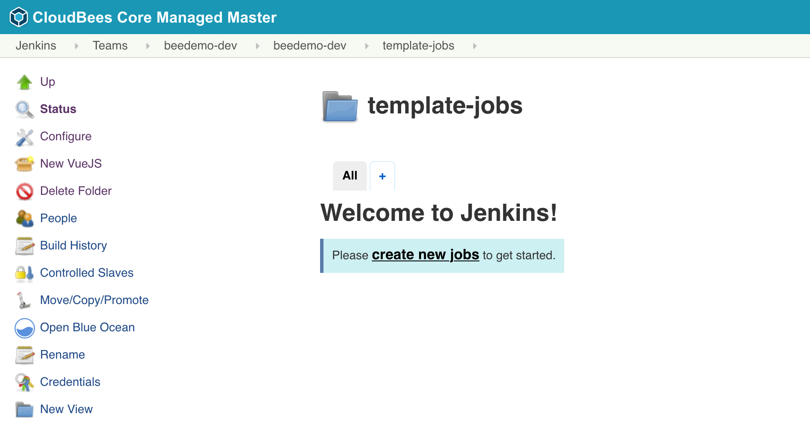
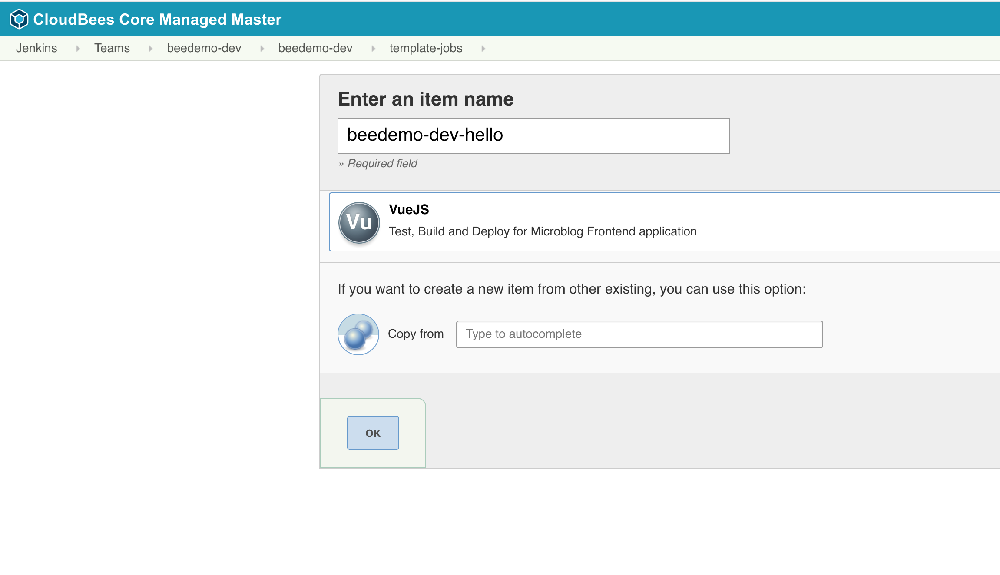

# Preview Environments with CloudBees Core

Pipeline Template Catalogs provide version controlled paramaterized templates for Multibranch and stand-alone Pipeline jobs. In this exercise we will use a [Pipeline Template Catalogs](https://github.com/cloudbees-days/pipeline-template-catalog/tree/master/templates/nodejs-app) to create another Multibranch Pipeline project for your forked **microblog-frontend** repository. All you will need to do is fill in a few simple parameters and you will end up with a complete end-to-end CI/CD Pipeline for the **microblog-frontend** application - and it won't be using the `Jenkinsfile` from your repository.

## Create a Multibranch Project from a Pipeline Template Catalogs
[Jenkins Configurations as Code](https://wiki.jenkins.io/display/JENKINS/Configuration+as+Code+Plugin) (JCasC) was used to [pre-configure a Pipeline Template Catalog on everyone's Team Masters](https://github.com/kypseli/cb-core-mm/blob/kube-workshop/quickstart/init_07_pipeline_template_global_catalog.groovy) and there is a **template-jobs** folder in your Team Master named folder that has been configured (using the [CloudBees Folders Plus folder item filtering](https://go.cloudbees.com/docs/plugins/folders-plus/#folders-plus-sect-restrict)) to only allow the creation of jobs from that Catalog of templates. Now we will create a templatized end-to-end CI/CD Pipeline Multibranch project for your forked copy of the **microblog-frontend** repository.

1. On your Team Master navigate to the **template-jobs** folder
2. Click on the ***New VueJS*** link in the left menu 

3. Enter an item name of your **[GitHub username]-hello**, select **VueJS**  and click the **OK** button

4. Fill out the template parameters:
   1. **Repository Owner**: the GitHub Organization your created for the CloudBees Core workshop
   2. **Repository**: The name of your forked repository, "microblog-frontend"
   3. **GitHub Credential ID**: select the *username/password* credential you created for the the CloudBees Core workshop - it will show up as - [GitHub username]/******
   4. Click the **Save** button

5. After the initial scan you should see two jobs, for the two branches in your forked repository

## Deploy to Staging -- How do we want to handle this?
Now we will create a Pull Request and merge the change to the **master** branch of your forked copy of the **helloworld-nodejs** repository.

1. Navigate to your forked **helloworld-nodejs** repository in GitHub - click on the **New pull request** button 

2. Change the **base repository** to the **master** branch of your forked **helloworld-nodejs** repository (not the **cloudbees-days** repository), add a comment and then click the **Create pull request** button
3. A job will be created for the pull request and once it has completed successfully your pull request will show that **All checks have passed**. Go ahead and click the **Merge pull request** button and then click the **Confirm merge** button but **DO NOT DELETE** the **development** branch
4. Navigate to the **helloworld-nodejs** Pipeline Template Catalog job in Blue Ocean on your Team Master and the job for the **master** branch should be running or queued to run
5. The templated job will build a Docker image for your **helloworld-nodejs** application, push the image to the Google Container Registry (GCR), and then deploy your containerized application to a staging environment in Kubernetes - a link to your application will be available in the logs of your job. 

### GitOps with Core v2
As part of the deployment to *staging* the Pipeline Template Catalog job will create a new **environment-staging** repository in your workshop GitHub Organization with the generated Kubernetes deployment yaml used for the deployment to the K8s *staging* environment.
