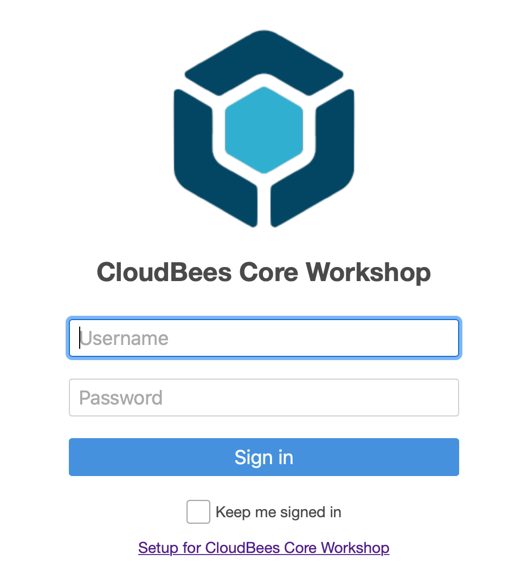
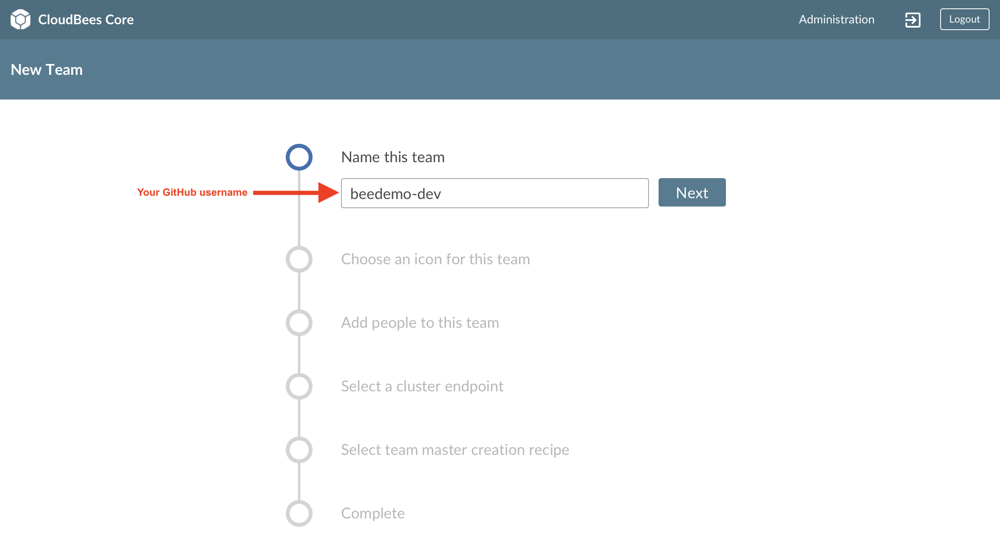
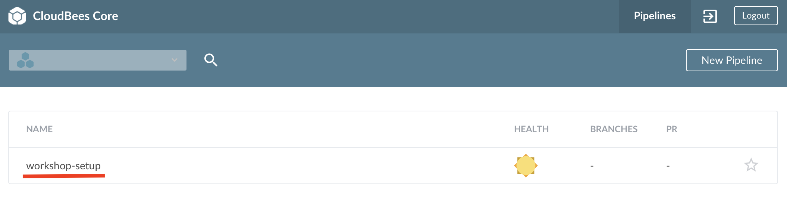
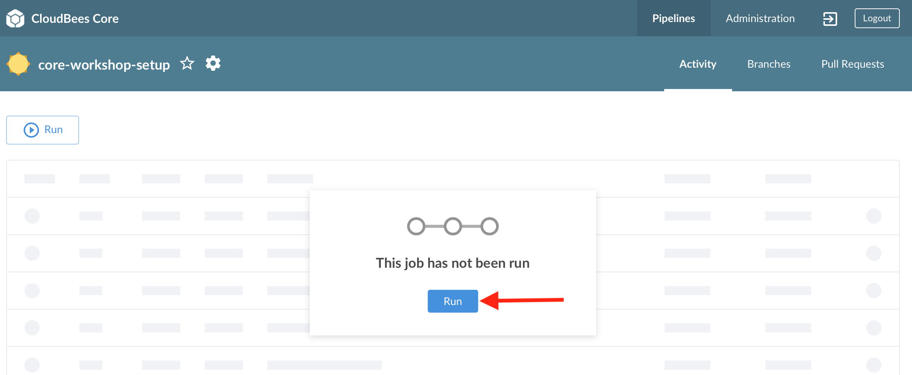
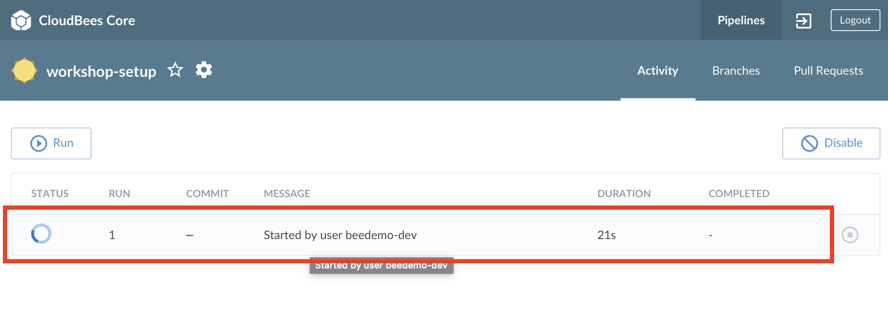
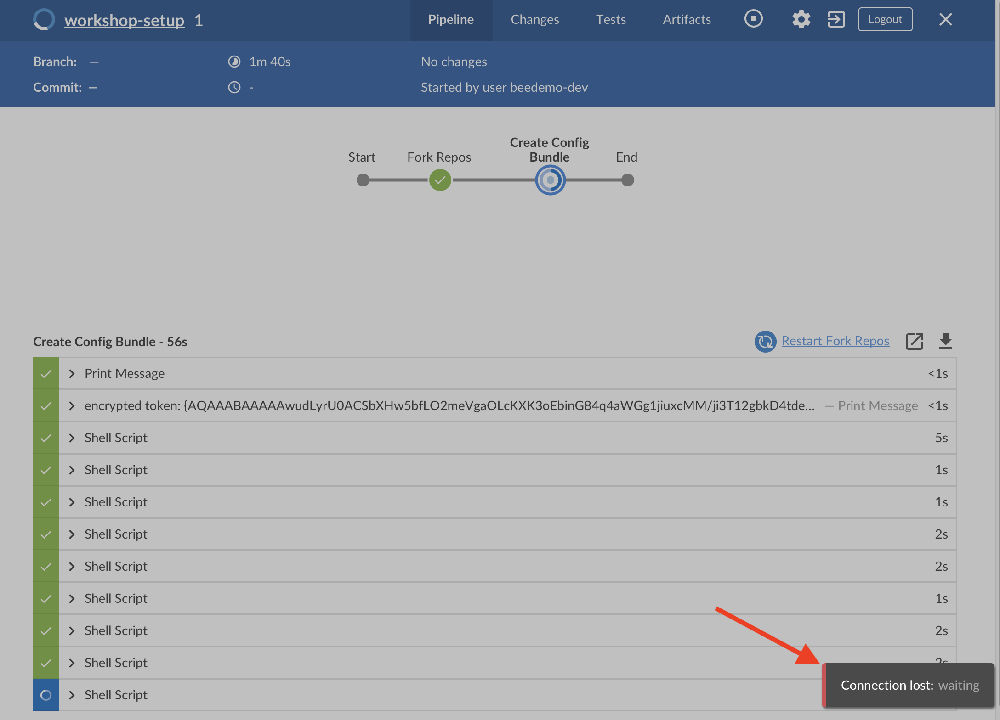

#  CloudBees Core Workshop Setup 

## CloudBees Core Workshop Set-up
In this lab you will setup a work environment for the CloudBees Core labs.  Ask the instructor for the URL of the server you will be using for the Core Workshop.

Today's URL for the CloudBees Core Workshop environment will be provided by your instructor. If you haven't already signed up for an account then follow [these instructions](../workshop-setup/workshop-setup.md) and then come back to the *Core Workshop Set-up*.

### Login to CloudBees Core

1. Goto to the Workshop URL provided by the instructor.
2. Enter the username and password you created earlier into the login screen.

### Create a Team Master

1. If not in CloudBees Team UI, click on the **Teams** link in the left menu. 

2. Click on the **Create team** button in the center of your screen.

3. **Name this team** - enter a name for your team - **IMPORTANT: to ensure uniqueness, use your GitHub username** and then click **Next**.

4. **Choose an icon for this team** to help uniquely identify your team - select an icon and color for your team and then click **Next**.
5. **Add people to this team** - your user will show up as a **Team Admin** and we won't be adding any additional users right now, but feel free to look around and then click **Next**.
6. **Select the cluster endpoint to create the team in** - just stick with the default value `kubernetes` and click **Next**.
7. **Select team master creation recipe** - click on the drop-down to see the options, but just stick with the **Basic** recipe.
8. Finally, click the **Create team** button. 

9. While your Core Team Master is being created (**it takes anywhere from 2-3 minutes to provision your Team Master**), move onto the next section.

## Create a GitHub.com Account

Feel free to use an existing GitHub.com account, otherwise create one:
1. Visit https://github.com/join and fill in the required fields to create a user account.
2. Select "Unlimited public repositories for free" when choosing your plan.
3. Verify your email account to ensure you account is activated.  An activated account will be **required** for the rest of this workshop.

## Create a GitHub Personal Access Token

1. Click on [this link to automatically select the required **Personal access token settings**](https://github.com/settings/tokens/new?scopes=repo,read:user,user:email,admin:repo_hook,admin:org_hook)
2. Click on **Generate Token**
3. As the success message says: **Make sure to copy your new personal access token now. You won’t be able to see it again!**  

## Create a GitHub Organization

1. On GitHub navigate to **Organizations**: https://github.com/settings/organizations (after logging in) 
2. Click on **New Organization** 

3. Fill in the **Organization Name**, **Billing Email**, and click on **Create Organization**

4. On the **Invite organization members** - just click the **Continue** button. On the next page, **Enter Organization Details**, either click **Submit** button or **skip this step** to finish creating the GitHub Organization.

>NOTE: Even though you have to provide an email for billing, you will NOT be charged anything as long as you choose the free option.
    
## Run Workshop Setup Pipeline
You should see the following Blue Ocean **Pipelines** screen with one Pipeline named **workshop-setup** for your Team:

1. Click on the `workshop-setup` Pipeline job.
2. On the next screen, click on the **Run** button in the middle of the screen. 

3. Fill in the required parameters: 

   1. ***githubPat*** - the GitHub Personal Access Token you created above.
   2. The GitHub username/account id you used to create the above GitHub Personal Access Token.
   3. The name of the GitHub Organization you created above specifically for this workshop
   4. The Kubernetes Namespace where your Team Master has been deployed - only change the default value if you are instructed to do so.
4. Once you have provided the above required input parameters click the **Run** button at the bottom of the parameters input form.
5. Blue Ocean will automatically switch to the Pipeline **Activity** screen, click anywhere on the Pipeline run row to see the Pipeline run and view the logs. But make sure you don't click on the **Stop** button to the right of the red box in the screenshot below.

6. Once the **workshop-setup** Pipeline job completes successfully your Team Master will be restarted so you should see a **Connect lost: waiting** alert in the bottom right of your Blue Ocean screen.

**For instructor led workshops please returns to the [workshop slides](https://cloudbees-days.github.io/core-rollout-flow-workshop/core/#14).**

Otherwise, you may proceed to the next lab: [*Configuration as Code (CasC) for CloudBees Core*](../core-casc/core-casc.md) where we will explore your individual fork of the **core-config-bundle** repository or choose another lab on the [main page](../../README.md#workshop-labs).
