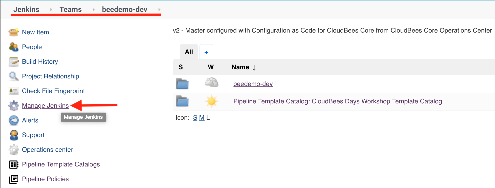

#  CloudBees Core - Cross Team Collaboration

# WORK IN PROGRESS

## Enabled Cross Team Collaboration Notifications

1. Navigate to the top-level of your Team Master and click on **Manage Jenkins** in the left menu. <p>
2. On the **Manage Jenkins** page scroll down and click on the **Configure Notification** link. <p>
3. Check the **Enabled** checkbox, select **Local Only** as the **Notification Router Implementation** and click the **Save** button. <p>

## Create a Pipeline to publish an event

1. On  your Team Master and ensure that you are in the folder with the same name as your Team Master - you should see the `workshop-setup` Pipeline job.

## Adding an event trigger


### The trigger

In any pub/sub relationship, it's important to understand the format of the data being sent and received. So let's take a look at the data the instructors job will be sending. 

```groovy
publishEvent jsonEvent('{
  "imageName": "node",
  "image": "{registry}/node:version"
}')
```

With this, we're going to want to trigger our job based on a search match on `imageName=='node'`.

Let's add this trigger block to our vuejs-app pipeline template catalog. If you haven't forked the catalog repo in the previous labs, you can do it [here](https://github.com/cloudbees-days/pipeline-template-catalog).

In your forked repo, navigate to `templates/vuejs-app/Jenkinsfile`.

Currently we have no defined triggers in this template:

```groovy
library 'cb-days@master'
def testPodYaml = libraryResource 'podtemplates/vuejs/vuejs-test-pod.yml'
pipeline {
  agent none
  options { 
    buildDiscarder(logRotator(numToKeepStr: '2'))
    skipDefaultCheckout true
    preserveStashes(buildCount: 2)
  }
  environment {
    repoOwner = "${repoOwner}"
    credId = "${githubCredentialId}"
  }
  stages('VueJS Test and Build')
...
```

To get this job to trigger on the event, we simply need to add the following block below the `agent none`:

```groovy
triggers {
  eventTrigger jmespathQuery("imageName=='node'")
}
```

For instructor led workshops please returns to the [workshop slides](https://cloudbees-days.github.io/core-rollout-flow-workshop/core/#33).

You may proceed to the next lab: [*Preview Environments with Core*](../core-preview-environment/catalog-templates.md) or choose another lab on the [main page](../../README.md#workshop-labs).