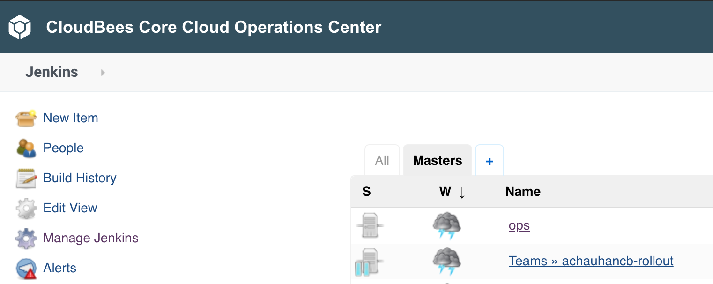

#  CloudBees Core - Hibernating Masters

The [CloudBees Core Managed Master hibernation](https://docs.cloudbees.com/docs/cloudbees-core/latest/cloud-admin-guide/managing-masters#_hibernation_in_managed_masters) feature takes advantage of running Core on Kubernetes by automatically shutting down or hibernating Team/Managed Masters after a specified amount of time of inactivity.

## Configure Hibernation
The Master Hibernation is managed at the global Jenkins configuration level and was configured in the `jenkins.yaml` file in the Core CasC lab.

## Un-hibernate a Master

1. Navigate to the classic UI of Operations Center and find your Team Master in the list of masters. 
2. If there is a light blue **pause** icon next to your Team  Master then it is hibernating. Just click on the link for your Team Master to **un-hibernate** it. 

3. Once you click on your Team Master link from the classic UI of Operations Center you will see a screen that shows that it is "getting ready to work". 

4. After a couple of minutes, your Team Master will be ready to use and in the same state as it was when it hibernated.

## Hibernation Proxy for Webhooks
The hibernating monitor service provides a post proxy for things like GitHub webhooks.

Navigate to the GitHub Organization you created for this workshop and click on the **Settings** link. 

In the **Organization settings** menu click on the **Webhooks** link. 

Click on the **Edit** button next to the webhook that was created for your Team Master.

Update the **Payload URL** by inserting `/hibernation/queue` in front of `/github-webhook/`.

Scroll down and click on the **Update webhook** button.

Please return to the [main page](../../README.md#workshop-labs) for other workshops and labs.
