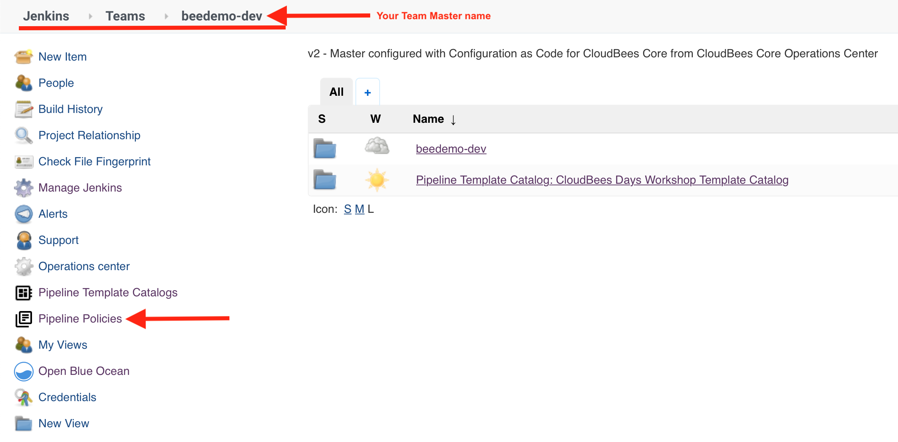
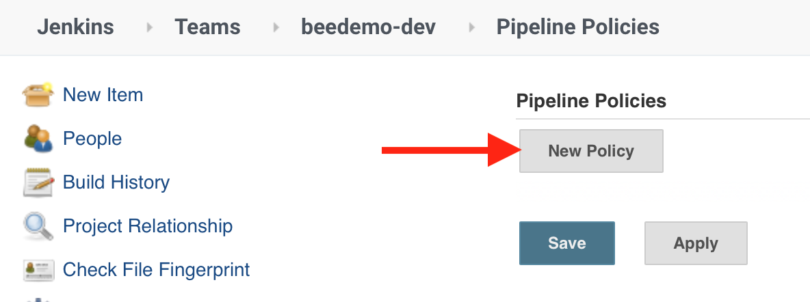
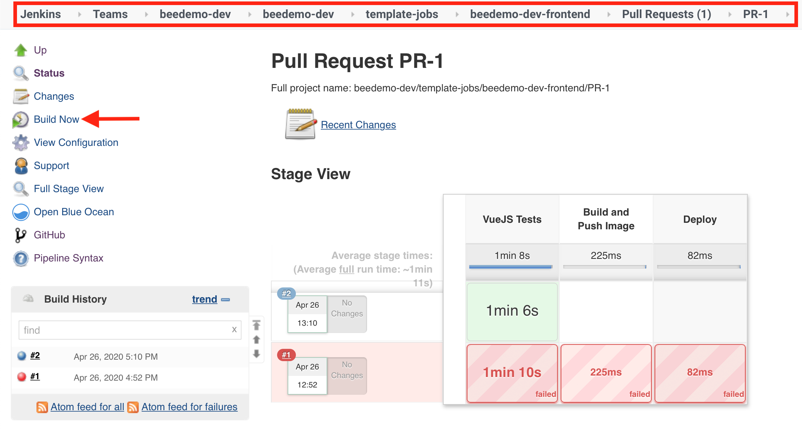
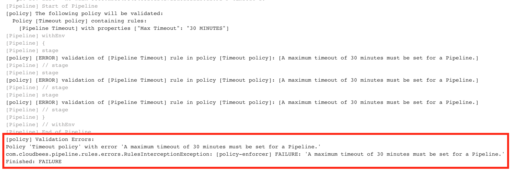

#  CloudBees Core - Pipeline Policies

## Create a Pipeline Policy

In this lab you will create a [Pipeline Policy](https://docs.cloudbees.com/docs/admin-resources/latest/pipelines-user-guide/pipeline-policies) to ensure that all Pipeline jobs that run on your Team Master have a 30 minute global `timeout` set.

1. Navigate to the top-level of your Team Master and click on **Pipeline Policies** in the left menu. 

2. Click on **New Policy**

3. Fill out the Pipeline Policy parameters:
   1. **Name**: Timeout policy
   2. **Action**: Fail
   3. Click on **Add Rule** button: 
      1. Select **Pipeline Timeout**
      2. **Timeout**: 30 MINUTES
   4. Click the **Save** button 

4. Navigate back to the **master** branch job for the **microblog-frontend** Mutlibranch project and click the **Build Now** link in the left menu. 

5. Navigate to the logs for that build and you will see that the build failed due to **Validation Errors** 

6. To fix this we will have to update the `Jenkinsfile` of the **VueJS** template in your forked copy of the **pipeline-template-catalog** repository - remember, even though we are building the code in the **microblog-frontend** repository the `Jenkinsfile` is actually coming from the **VueJS** template. Navigate to that `Jenkinsfile` and the click the **pencil icon** to open it in the GitHub editor. 

7. In the GitHub editor, uncomment the `timeout` pipeline `option` and then click the **Commit changes** button to commit the updated `Jenkinsfile` to your **master** branch. 

8. Next, to ensure that we are using the updated **VueJS** template, we will **re-import** the Pipeline Template Catalog you just updated. Navigate to the top-level of your Team Master and click on **Pipeline Template Catalogs** in the left menu and then click the **workshopCatalog** link. 

9. On the next screen, click the **Run Catalog Import Now** link.  

10. After the import is complete, navigate back to the **master** branch job for the **microblog-frontend** Mutlibranch project and click the **Build Now** link in the left menu. The build will complete successfully and the logs for that build will show that the all polices validated successfully. 

**For instructor led workshops please returns to the [workshop slides](https://cloudbees-days.github.io/core-rollout-flow-workshop/core/#31).**

You may proceed to the next lab: [*Cross Team Collaboration*](../cross-team-collaboration/cross-team-collaboration.md) or choose another lab on the [main page](../../README.md#workshop-labs).