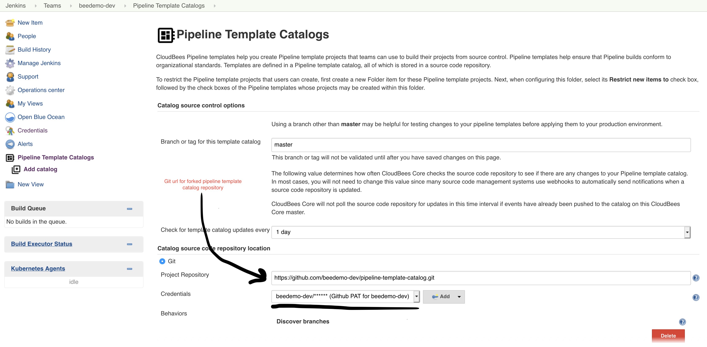

#  CloudBees Core - Pipeline Template Catalogs

Pipeline Template Catalogs help ensure that Pipeline jobs conform to organizational standards.

## Import Pipeline Template Catalog
1. Fork https://github.com/cloudbees-days/pipeline-template-catalog
2. Navigate to team master level and click on "Pipeline Template Catalogs"

3. Click on "Add catalog"

4. Fill out the catalog import parameters:
   1. **Branch or tag for this template catalog**: master
   2. Check off **Git**
   3. **Project Repository**: The Git URL for the forked pipeline template catalog repo created in step 1.
   4. **Credentials**: select the *username/password* credential you created for the the CloudBees Core workshop - it will show up as - [GitHub username]/******
   5. Click the **Save** button

5. You should see the following once your catalog has been succesfully imported

6. Navigate back inside your team master and click in to the folder with your team name

7. Click on the **New Item** link in the left menu

You may proceed to the next lab: [*Pipeline Policies*](../pipeline-policies/pipeline-policies.md) or choose another lab on the [main page](../../README.md#workshop-labs).
