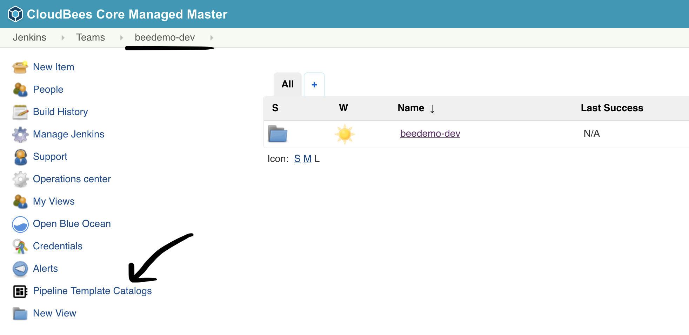
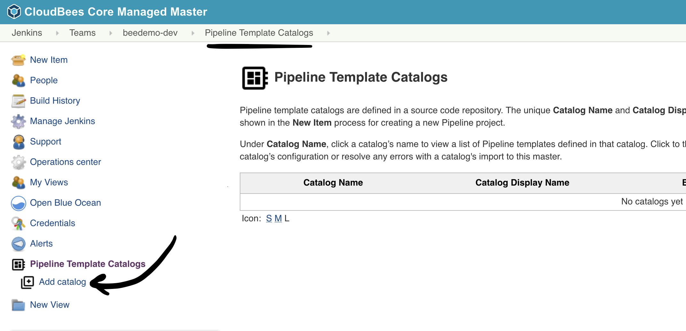
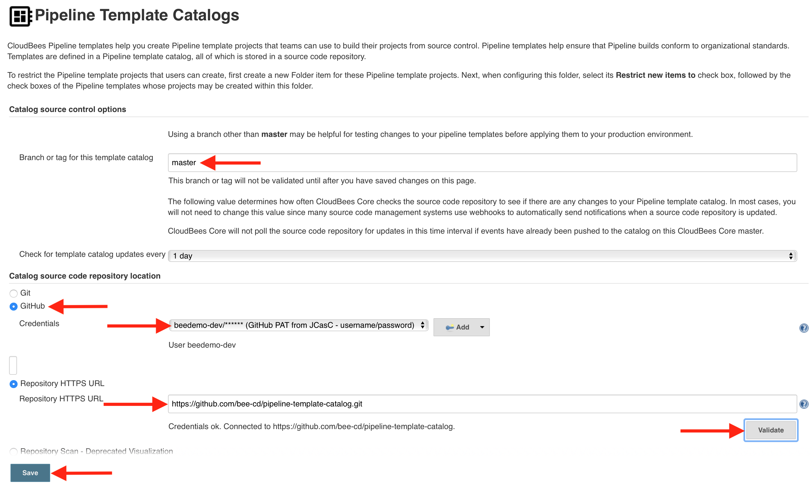
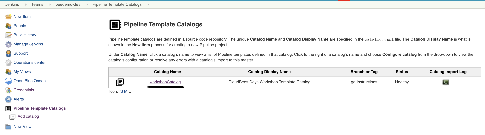
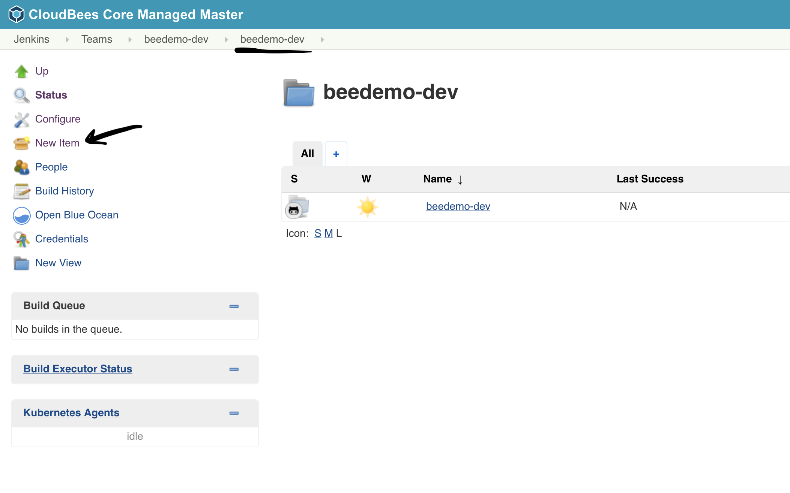
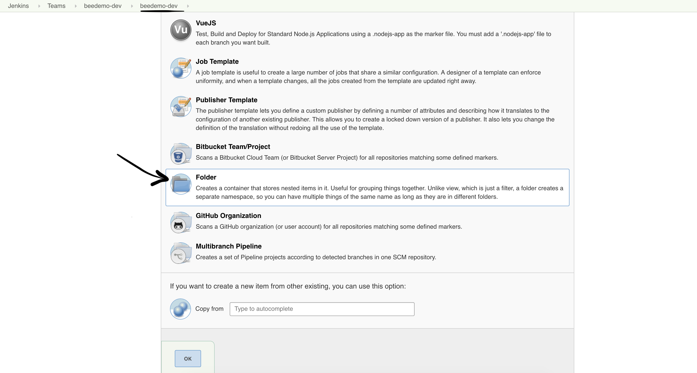
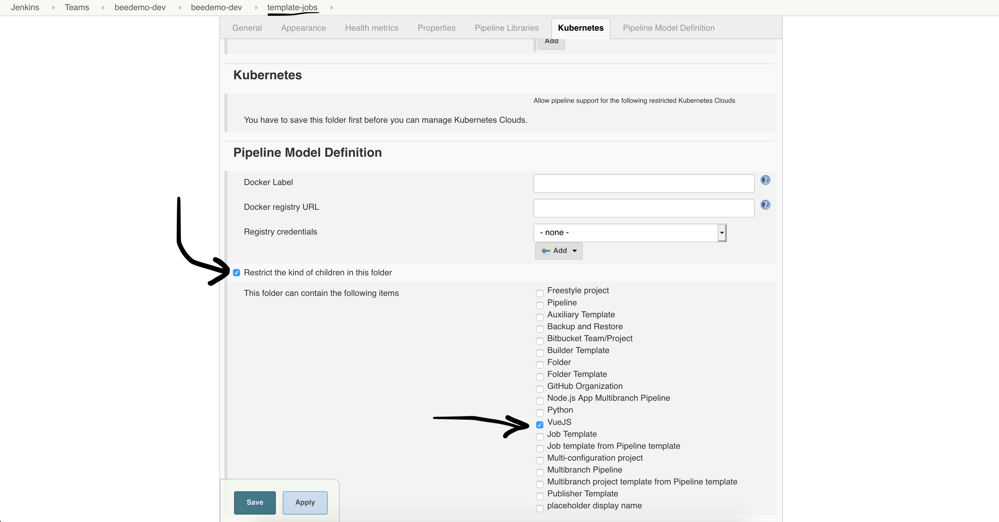
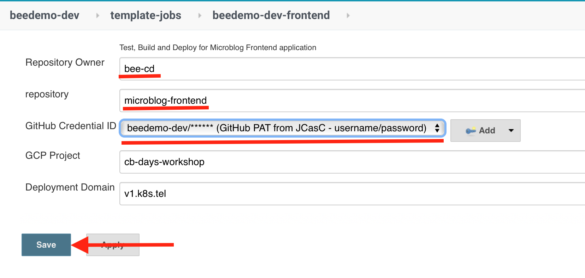
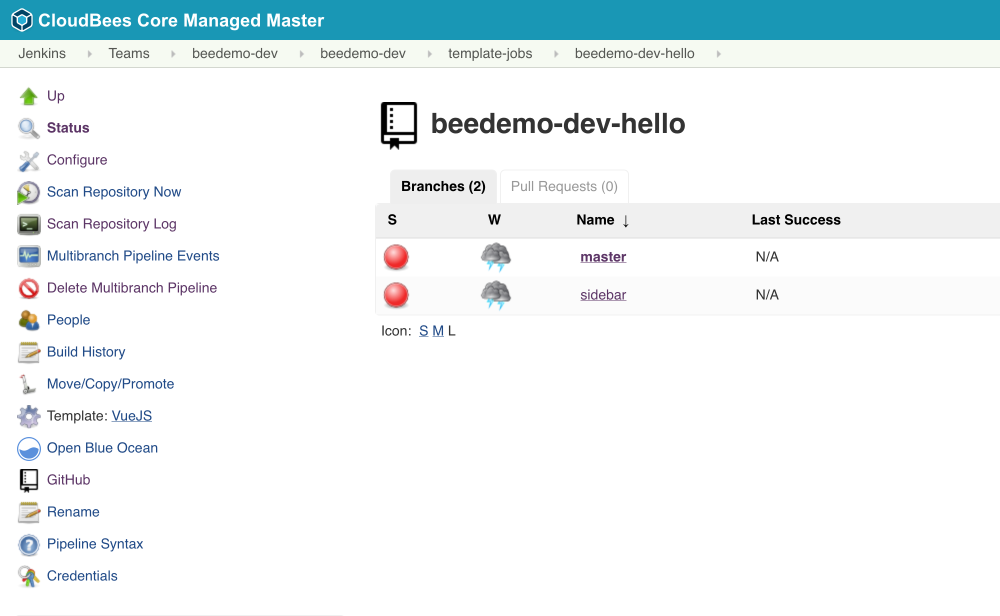

#  CloudBees Core - Pipeline Template Catalogs

## Import Pipeline Template Catalog
1. Navigate to the top-level of your Team Master level and click on **Pipeline Template Catalogs** in the left menu

2. Click on **Add catalog**

3. Fill out the catalog import parameters:
   1. **Branch or tag for this template catalog**: master
   2. Select **GitHub** under **Catalog source code repository location**
   3. **Credentials**: select the *username/password* credential you created for the CloudBees Core workshop - it will show up as - `[GitHub username]/******`
   4. **Repository HTTPS URL**: The Git URL for your forked Pipeline Template Catalog repository.
   5. Next, click the **Validate** button to ensure your credentials and repository URL are set correctly.
   6. Finally, click the **Save** button 

4. You should see the following once your Pipeline Template Catalog has been successfully imported

5. On your Team Master navigate to the folder with the same name as your Team Master - you should see the `workshop-setup` Pipeline job.
6. Click on the **New Item** link in the left menu

7. We will now create a new folder called ***template-jobs***. 

8. Inside of the folder configuration click on "**Restrict the kind of children in this folder**" - a [CloudBees Folders Plus](https://docs.cloudbees.com/docs/cloudbees-core/latest/cloud-secure-guide/folders-plus) feature - and then select "**VueJS**" only and then hit the **Save** button. 

   
## Create vue.js Job from Pipeline Template Catalog
In this lab you will create a new Multibranch Pipeline job from the **VueJS** template provided by the Pipeline Template Catalog you added above - just by filling in a few parameters.

1. On your Team Master navigate into the **template-jobs** folder that you created in the previous lab.
2. Click on the ***New VueJS*** link in the left menu. 

3. Enter an item name of your **[GitHub username]-frontend**, select **VueJS**  and click the **OK** button. 

4. Fill out the template parameters:
   1. **Repository Owner**: the GitHub Organization your created for the CloudBees Core workshop
   2. **Repository**: The name of your forked repository, *microblog-frontend*
   3. **GitHub Credential ID**: select the *username/password* credential created for you by the **wokshop-setup** job and Core CasC - it will show up as - [GitHub username]/******
   4. Click the **Save** button

5. After the initial scan you should see one job for a GitHub pull request - **PR-1**.

## Deploy to Staging
Both jobs should automatically start running for both branches, however only the **master** branch job will deploy because the **Deploy** stage is configured to only run for the **master** branch.

The templated job will build a Docker image for your **microblog-frontend** application, push the image to the Google Container Registry (GCR), and then deploy your containerized application to a staging environment in Kubernetes - a link to your application will be available in the logs of your job. 

Congratulations! You have imported a Pipeline Template Catalog into your Team Master and then created a folder where only the job from that template can be created.

For instructor led workshops please returns to the [workshop slides](https://cloudbees-days.github.io/core-rollout-flow-workshop/core/).

Otherwise, you may proceed to the next lab: [*CloudBees Pipeline Policies*](../pipeline-policies/pipeline-policies.md) or choose another lab on the [main page](../../README.md#workshop-labs).
