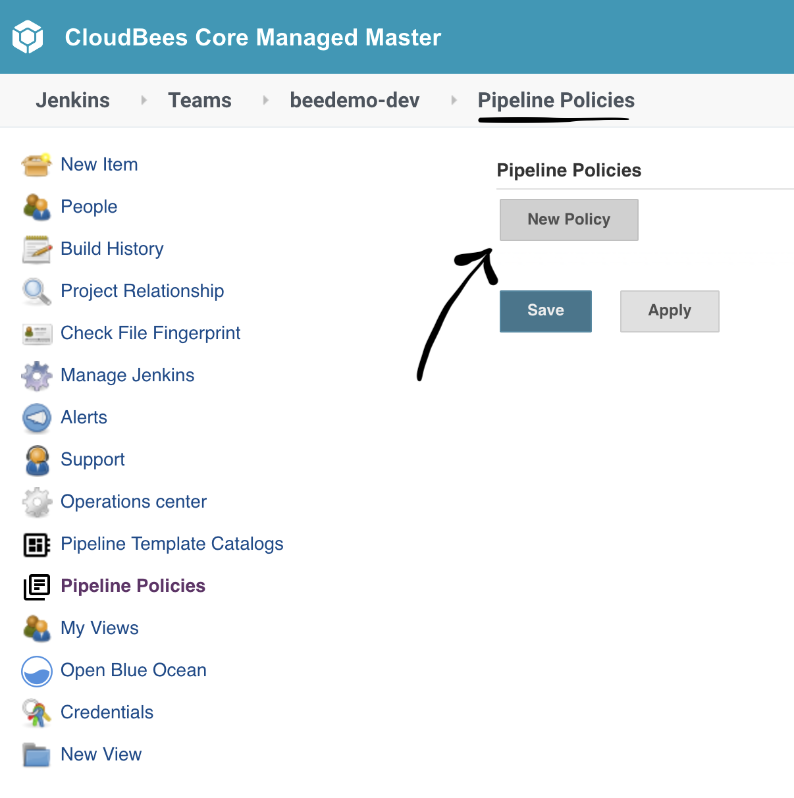
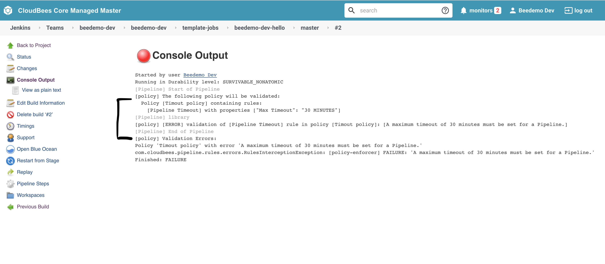

#  CloudBees Core - Pipeline Template Catalogs & Pipeline Policies

Pipeline Template Catalogs help ensure that Pipeline jobs conform to organizational standards.

## Import Pipeline Template Catalog
1. The pipeline template catalog repository: https://github.com/cloudbees-days/pipeline-template-catalog should have been forked for you automatically at the start of this workshop.
2. Navigate to team master level and click on "Pipeline Template Catalogs"

3. Click on "Add catalog"

4. Fill out the catalog import parameters:
   1. **Branch or tag for this template catalog**: master
   2. Check off **Git**
   3. **Project Repository**: The Git URL for the forked pipeline template catalog repo created in step 1.
   4. **Credentials**: select the *username/password* credential you created for the the CloudBees Core workshop - it will show up as - [GitHub username]/******
   5. Click the **Save** button

5. You should see the following once your catalog has been succesfully imported

6. Navigate back inside your team master and click in to the folder with your team name

7. Click on the **New Item** link in the left menu

8. We will now create a new folder called "**Template Jobs**"

9. Inside of the folder configuration click on "**Restrict the kind of children in this folder**" and then select "**VueJS**" only and then hit save

   
## Create vue.js Job from Pipeline Template Catalog
In this exercise you will create a new Multibranch Pipeline job from the Pipeline Template Catalog you added above.

1. On your Team Master navigate to the **template-jobs** folder
2. Click on the ***New VueJS*** link in the left menu 

3. Enter an item name of your **[GitHub username]-hello**, select **VueJS**  and click the **OK** button

4. Fill out the template parameters:
   1. **Repository Owner**: the GitHub Organization your created for the CloudBees Core workshop
   2. **Repository**: The name of your forked repository, "microblog-frontend"
   3. **GitHub Credential ID**: select the *username/password* credential you created for the the CloudBees Core workshop - it will show up as - [GitHub username]/******
   4. Click the **Save** button

5. After the initial scan you should see two jobs, for the two branches in your forked repository

## Deploy to Staging
Both jobs should automatically start running for both branches, however only the master branch job will deploy because of the way the pipeline was written.

The templated job will build a Docker image for your **microblog-frontend** application, push the image to the Google Container Registry (GCR), and then deploy your containerized application to a staging environment in Kubernetes - a link to your application will be available in the logs of your job. 

### GitOps with Core v2
As part of the deployment to *staging* the Pipeline Template Catalog job will create a new **environment-staging** repository in your workshop GitHub Organization with the generated Kubernetes deployment yaml used for the deployment to the K8s *staging* environment.

## Create a Pipeline Policy
[Pipeline Policies for CloudBees Core](https://docs.cloudbees.com/docs/admin-resources/latest/pipelines-user-guide/pipeline-policies) allow organizations to enforce standards across Pipeline jobs.

In this exercise you will create a Pipeline Policy to ensure that all Pipeline jobs that run on your Team Master have a `timeout` set.

1. Navigate to team master level and click on "Pipeline Policies"

2. Click on "New Policy"

3. Fill out the Pipeline Policy parameters:
   1. **Name**: Timeout policy
   2. **Action**: Fail
   3. Click on **Add Rule** and select **Pipeline Timeout**
   4. **Timeout**: 30 MINUTES
   5. Click the **Save** button

4. Navigate back to your master branch job inside of the **Template Jobs** folder and hit **Build Now**
5. In the logs of the last run master branch job you should see the following error:

Congratulations! You have imported a pipeline template catalog into your team master and then created a folder where only the job from that template can be created.

You may proceed to the next lab: [*Cross Team Collaboration*](../cross-team-collaboration/cross-team-collaboration.md) or choose another lab on the [main page](../../README.md#workshop-labs).
