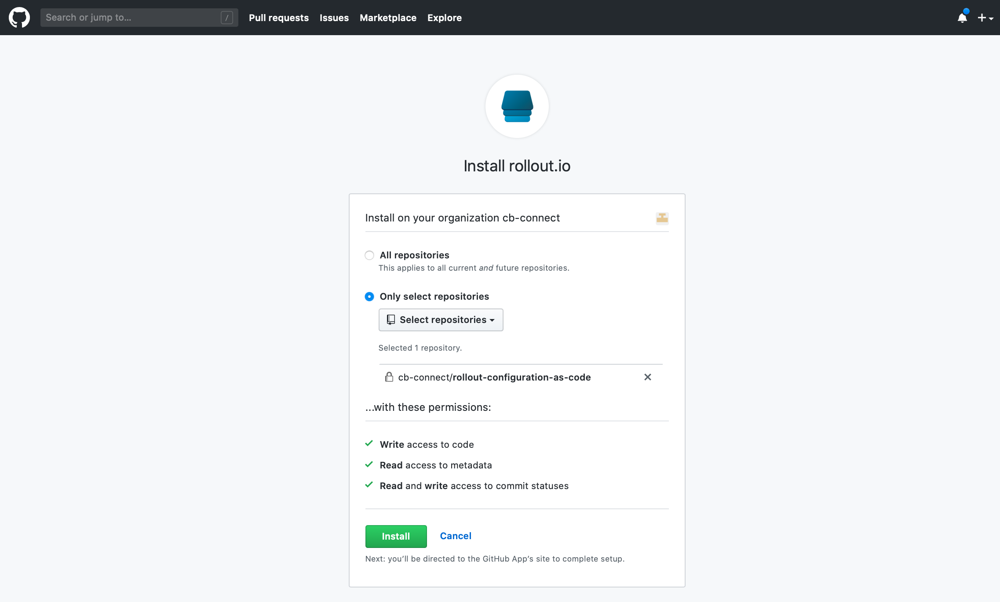
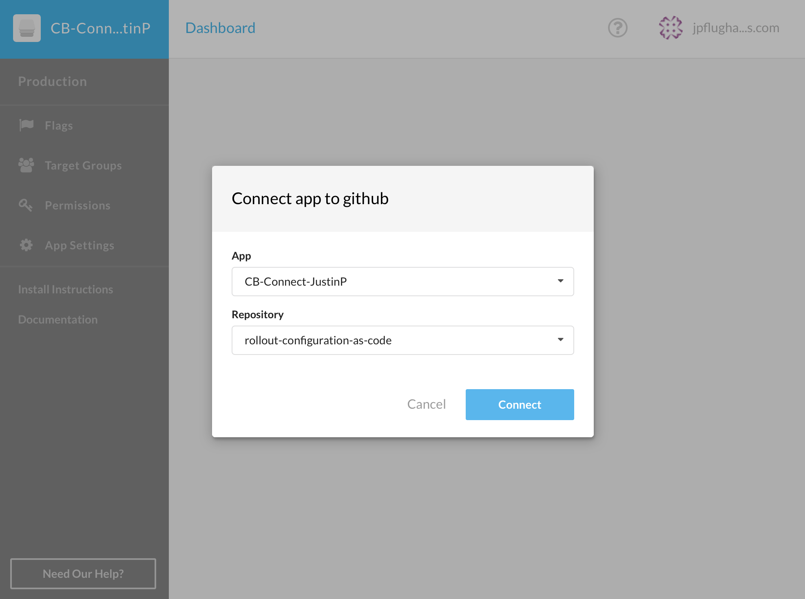

## Feature Flags and GitOps
### Connecting to GitHub Cloud
1. Create an empty repository in your GitHub organization
2. Connect the Rollout app into the Github repository
  1. Go to **App Settings > Integrations tab** (from the left Panel)
  2. Click the **Connect** button
  

3. In GitHub, select to integrate the Rollout GitHub app with your created repository.

4. After clicking **Install**, you will be redirected back to the CloudBees Rollout dashboard to select your app and the repository

5. Click connect and you are done

### Using GitOps
1. In Rollout, create a new environment "Pre-Production"
2. Copy each experiment from Production environment into Pre-Production
3. In GitHub, switch from master branch to our automatically created Pre-Production branch. Go look at your `experiments` folder, click on `default.sidebar.yml`
4. Within the Github code editor, modify default flag value and commit to Pre-Production branch.
5. In Rollout, notice that your default.sidebar experiment default value is updated
6. Modify target experiment via git
7. Discuss locking down Prod env in Rollout, only allow changes via GitOps

TODO:
* add pictures
* add content
