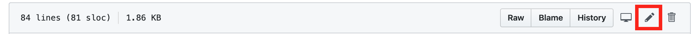

#  Gating Code with a CloudBees Feature Flag

## Using a Rollout Feature Flag
In this lab, you will gate a component behind the `title` feature flag, defined in the previous lab. Later, using Rollout's dashboard, we will remotely configure the value of the flag, to either expose or hide this title element at will.

### Adding a Title to the Microblog Post

1. In Github, navigate to the root directory of the microblog-frontend repository. Ensure that you are on the `development` branch.
2. Navigate to the `Posts.vue` file (`src/views/Posts.vue`) by clicking the `src` folder, `views` folder, followed by `Posts.vue`, consecutively.

<p>

3. Select the pencil icon to edit the file.

<p>

4. In order to use the feature flags created in the `flags.js` file, we've included the `import` statement on **Line 50**. Now, we'll create a function called `show_title` that will return the `boolean` value from `Flags.title.isEnabled()`.

To add this functionality, first insert a comma `,` at the end of the `show_sidebar` definition on **Line 63**. Then, add a new line after the comma, and define the `show_title` function as seen in the `data` segment below:
```javascript
data: function () {
  return {
    message: '',
    posts: [],
    users: [],
    errors: [],
    show_sidebar: Flags.sidebar.isEnabled(),
    show_title: Flags.title.isEnabled()
  }
},
```

5. Now we're going to add a new title component gated behind our `title` feature flag. This will allow the element to _only_ be displayed when `Flags.title.isEnabled()` is `true`. Update the code following code on **Line 5** to gate the *Show New Title!* text behind the `show_title` flag:
```html
 <h1 class="title">Posts <span v-if="show_title"> - Show New Title!</span></h1>
```

6. After editing, expand the following to review:
<details><summary>Updated <code>Post.vue</code></summary>

```html
<template>
  <div class="container">
    <hr class="hr is-invisible">
    <div class="box">
      <h1 class="title">Posts <span v-if="show_title"> - Show New Title!</span></h1>
      <hr class="hr">
      <div class="columns" v-if="show_sidebar">
        <div class="box column is-three-quarters">
          <div class="box">
            <b-field label="What's going on today?"
                     class="is-marginless"
            >
              <b-input v-model="message" maxlength="140" type="textarea"/>
            </b-field>
            <b-button type="is-dark" @click="addPost">Submit</b-button>
          </div>
          <hr class="hr">
          <Post v-for="post in posts" :key="post.id" :post="post"/>
        </div>
        <div class="box column">
          <h3 class="is-size-4 has-text-weight-bold">Users list</h3>
          <ul>
            <li v-for="user in users" :key="user.url">
              <a :href="user.url">{{user.username}}</a>
            </li>
          </ul>
        </div>
      </div>

      <div class="box" v-else>
        <div class="box">
          <b-field label="What's going on today?"
                   class="is-marginless"
          >
            <b-input v-model="message" maxlength="140" type="textarea"/>
          </b-field>
          <b-button type="is-dark" @click="addPost">Submit</b-button>
        </div>
        <hr class="hr">
        <Post v-for="post in posts" :key="post.id" :post="post"/>
      </div>
    </div>
  </div>
</template>

<script>
import Post from '@/components/Post.vue'
import axios from 'axios'
import { mapGetters, mapState } from 'vuex'
import { Flags } from '../utils/flags'

export default {
  name: 'posts',
  components: {
    Post
  },
  data: function () {
    return {
      message: '',
      posts: [],
      users: [],
      errors: [],
      show_sidebar: Flags.sidebar.isEnabled(),
      show_title: Flags.title.isEnabled()
    }
  },
  created () {
    this.getPosts()
    this.getUsers()
  },
  computed: {
    ...mapGetters([
      'isLoggedIn'
    ]),
    ...mapState([
      'user'
    ])
  },
  methods: {
    getPosts: function () {
      axios.get(`${process.env.VUE_APP_BASE_API_URL}/posts/`)
        .then(response => {
          this.posts = response.data
        })
        .catch(error => {
          this.errors.push(error)
        })
    },
    getUsers: function () {
      axios.get(`${process.env.VUE_APP_BASE_API_URL}/users/`)
        .then(response => {
          this.users = response.data
        })
        .catch(error => {
          this.errors.push(error)
        })
    },
    addPost: function () {
      if (this.message.length > 1 && this.message.length <= 140) {
        axios.post(`${process.env.VUE_APP_BASE_API_URL}/posts/`, {
          user: this.user.url,
          message: this.message
        }, {
          headers: {
            'Authorization': `Bearer ${localStorage.getItem('token')}`,
            'Content-Type': 'application/json'
          }
        })
          .then(() => {
            this.getPosts()
            this.message = ''
          })
          .catch(e => {
            this.errors.push(e)
          })
      }
    }
  }
}
</script>
```
</details>

7. Create a commit message (e.g. "Added title component") and select the **Commit directly to the `development` branch** radio button. Click **Commit changes**.

### Adding the Configuration Fetched Handler

The Configuration Fetched Handler provides a mechanism to alert the Rollout SDK when an updated configuration, from local storage or via an asynchronous network call, has loaded. It allows us to control what happens whenever a new configuration is fetched, and can be useful for troubleshooting by logging the `fetchedResults`. To apply the changes for client-side feature flags from the new configuration, an action (like a page refresh) has to take place.

1. In Github, navigate to the root directory of the microblog-frontend repository on the `development` branch.
2. Open the `flags.js` file (navigating to `src/utils/flags.js`), and select the pencil icon to edit the file.
3. We will induce the page refresh when a **new** configuration is retrieved **from the network**. We can also assist in any troubleshooting by adding `console.log` statements. Define the `configurationFetchedHandler` constant with its boolean logic cases; also, **ensure it is called in `options` constant** as seen in the `flags.js` file below:

<details><summary>Updated <code>flags.js</code></summary>

```javascript
import Rox from 'rox-browser'

export const Flags = {
  sidebar: new Rox.Flag(false),
  title: new Rox.Flag(false)
};

export const configurationFetchedHandler = fetcherResults => {
  console.log('The configuration status is: ' + fetcherResults.fetcherStatus)
  if (fetcherResults.hasChanges && fetcherResults.fetcherStatus === 'APPLIED_FROM_NETWORK') {
    window.location.reload(false)
  }
  else if (fetcherResults.fetcherStatus === 'ERROR_FETCH_FAILED') {
    console.log('Error occured! Details are: ' + fetcherResults.errorDetails)
  }
};

const options = {
  configurationFetchedHandler: configurationFetchedHandler
};

Rox.register('default', Flags);
Rox.setup(process.env.VUE_APP_ROLLOUT_KEY, options);

```
</details>

1. Create a commit message (e.g. "Inserted configurationFetchedHandler") and select **Commit directly to the `development` branch** radio button. Click **Commit changes**.

### Checking Microblog Website

1. Switch tabs to your CloudBees Core team master. You should see the results of a _previous_ micoblog-frontend pipeline.
2. In the left corner of the header, use the **right arrow** to navigate to **the most recent** pipeline run (until the right arrow is no longer shown).
3. Once the _entire_ pipeline is complete (header should turn green), navigate to the microblog website (either by switching tabs or clicking the link supplied in the last step of **Deploy** stage).
4. Refresh the page, and open the console from your browser's developer tools. Check the log to view the messages from the `configurationFetchedHandler`.
5. Navigate to your CloudBees Core Team Master.
6. Navigate to the **microblog-frontend** Jenkins Pipeline job for your **development** branch.
7. Open Blue Ocean
8. Click `development` branch to see the pipeline.
9. Click deploy, and the last shell script. Open the URL 

**For instructor led workshops please return to the [workshop slides](https://cloudbees-days.github.io/core-rollout-flow-workshop/rollout/#16)**

Otherwise, you may proceed to the next lab: [**Control the Value of a Flag with CloudBees Rollout**](../rolloutExperiment/rolloutExperiment.md) or choose another lab on the [main page](../../README.md#workshop-labs).
