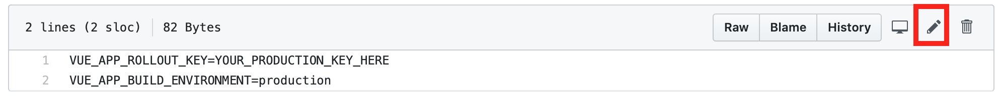
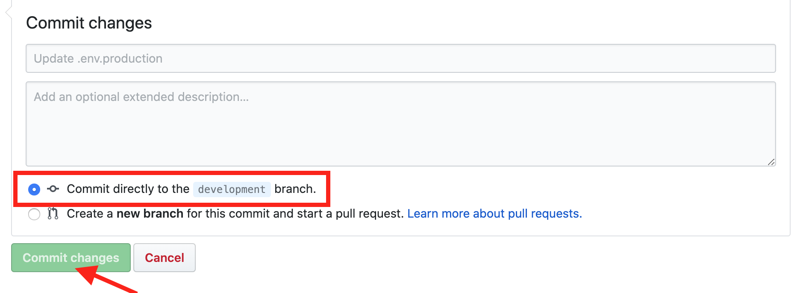
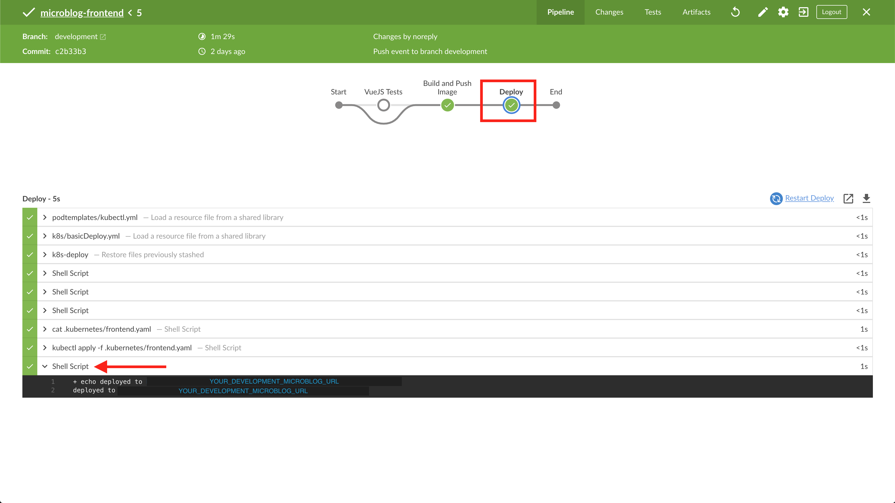
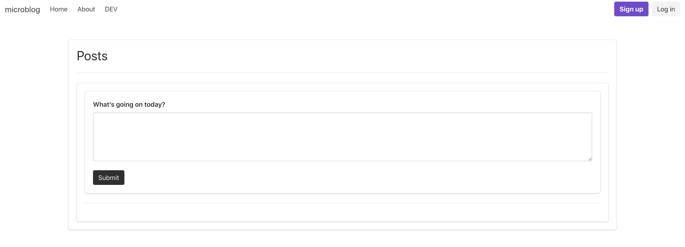
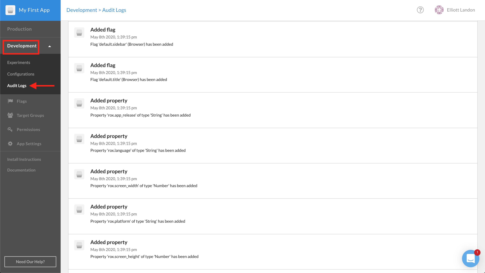

#  CloudBees Rollout Workshop Setup

## CloudBees Rollout Set-Up
In this lab, you will set up a CloudBees Rollout account and use it to manage feature flags through remote configurations created in the dashboard.

### Create a CloudBees Rollout Account

1. Open the CloudBees Rollout [sign-up form](https://app.rollout.io/signup) in a _new tab_ within your internet browser.
2. Fill out the form with your name, email, and a created password. After confirming your password,  check the box agreeing to Rollout's Terms of Service (which can be viewed [here](https://docs.cloudbees.com/docs/cloudbees-common/latest/subscription-agreement/)), and click **Sign Up**.
3. After sign up, the Rollout dashboard should be displayed. On the far left side of the dashboard, click the **App Settings** panel. From the resulting page, select the **Environments** tab.
4. Click **Add New Environment** and name it **Development**. Then click **Generate Key**.
5. **Close** the subsequent **Development Key** pop-up window so that both _Production_ and _Development_ keys are displayed. Leave this Rollout dashboard tab open in the browser. Both keys will be referenced later in this lab.

<p>

### Environment Variable

Our CloudBees Core pipeline will use a different Rollout environment key, stored in an variable within the repository, depending on which branch we deploy from. Later in the workshop, we'll learn how these separate environment keys can be leveraged to apply the multi-environment view of the Rollout dashboard. This will allow a flag to have a particular Production configuration, while using a completely different ruleset for the code connected to the Development environment.

1. Switch tabs to your Github organization created for the workshop. Navigate to the microblog-frontend repository within your organization.
2. Change the branch from `master` to `development`. _All work until some components of Lab 5 will take place on the `development` brach_. After changing branches, select the `.env.production` file.
3. Click the pencil icon to edit the file.

<p>

4. Switch back to your Rollout tab with the dashboard in view. Copy the `<ROLLOUT_ENV_KEY>` associated with the _Production_ environment. Navigate back to the Github tab with the `.env.production` file being edited.
5. Replace `YOUR_PRODUCTION_KEY_HERE` on **Line 1** by pasting your unique Production `<ROLLOUT_ENV_KEY>`.
6. At the bottom of the page, select **Commit directly to the `development` branch** radio button. Then click the **Commit changes** button.
7. Navigate back to the root directory of the microblog-frontend repository (`development` branch). Click the `.env.development` file. And then select the pencil icon on the following page to make an edit to the file.
8. Now, copy your _Development_ `<ROLLOUT_ENV_KEY>` from the Rollout dashboard. Then replace `YOUR_DEVELOPMENT_KEY_HERE` in the `.env.development` file by pasting the unique Development Rollout key.
9. Select the **Commit the file directly to the `development` branch** radio button, and then click **Commit changes**.

<p>

### Create Rollout Feature Flags

The `flags.js` file imports the relevant Rollout SDK and defines the feature flags (with its `DEFAULT` values) that an application will use. The file contains a call to the `setup` function that establishes a connection to the Rollout dashboard. The Rollout dashboard interface will allow for remote configuration in future labs.

1. In Github, navigate to the root level of the microblog-frontend repository (Ensure you are working on the `development` branch).
2. Change directories and select the `flags.js` file (`src\utils\flags.js`) by first clicking the `src` folder from root view, followed by the `utils` folder, and finally select the subsequent `flags.js` file.
3. We will later add a component to the **Posts view** of the microblog application that is gated by a `title` feature flag. Click the pencil to edit the file. Define the `title` flag and its default value (`false`) by adding the following within the `const Flag` section after **Line 4**:
```javascript
export const Flags = {
	sidebar: new Rox.Flag(false),
	title: new Rox.Flag(false)
};
```

**After this edit, the `flags.js` should be**
<details><summary>this:</summary>

```javascript
import Rox from 'rox-browser'

export const Flags = {
  sidebar: new Rox.Flag(false),
  title: new Rox.Flag(false)
};

const options = {
};

Rox.register('default', Flags);
Rox.setup(process.env.VUE_APP_ROLLOUT_KEY, options);

```
</details>

4. Commit the changes by adding a comment (e.g. "added title flag"), and select the **Commit directly to the `development` branch** radio button. And then click **Commit changes**.

### Adding .vuejs Marker File

1. Navigate to the root level of the microblog-frontend repository on the `development` branch. Click the **Create a new file** button.
2. Name the file `.vuejs` (don't forget the leading period).
3. Leave the file blank, commit the file by adding a comment (e.g. "New .vuejs file"). Ensure the **Commit directly to the `development` branch** radio button is enabled. Then select **Commit new file**.

### See Deployed Microblog Website

1. Switch tabs to your CloudBees Core team master. Select the **Blue Ocean** view associated with your team master. Then, click the **Pipelines** panel in the header of the Blue Ocean view.
2. Select the `microblog-frontend` pipeline. Then, click on the job currently running from the changes made on the `development` branch.
3. On the next page, you should see 3 stages that define the pipeline. Click the **Deploy** stage to see all the steps that will run during this stage.
4. When the **Deploy** stage has completed (indicated by the header turning green), select the **deployment url** step.

<p>

5. Open the URL in a new tab (that follows the format: `http://development.YOUR_ORG_NAME-microblog-frontend.cbws.io`). This is the microblog!

<p>

### Checking Communication with CloudBees Rollout

1. Switch tabs to CloudBees Rollout.
2. On the left-hand side of the dashboard, click the **Development** panel and then select the **Audit Logs** view from the drop down options.
3. You should see both the `default.title` and the `default.sidebar` flags added from the code are available for remote configuration in the dashboard! There are also some default properties that have been added, but we'll add more to use in a future lab.

<p>

### Lab 1 Completed!
Congratulations! You have finished Lab 1 of the CloudBees Rollout Workshop.

**For instructor led workshops please return to the [workshop slides](https://cloudbees-days.github.io/core-rollout-flow-workshop/rollout/#14).**

Otherwise, you may proceed to the next lab: [**Gating a Component with a CloudBees Feature Flag**](../rolloutFeature/rolloutFeature.md) or choose another lab on the [main page](../../README.md#workshop-labs).
