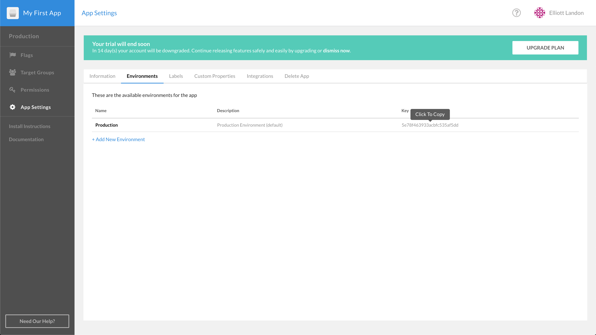

#  CloudBees Rollout Workshop Setup

## CloudBees Rollout Set-Up
In this lab, you will set up a CloudBees Rollout account and use it to manage feature flags through remote configurations created in the dashboard.

### Create a CloudBees Rollout Account

1. In a new tab, navigate to the CloudBees Rollout [sign-up URL](https://app.rollout.io/signup).
2. Fill out the form with your name, email, and created password. After confirming your password,  check the box agreeing to Rollout's Terms of Service (which can be viewed [here](https://docs.cloudbees.com/docs/cloudbees-common/latest/subscription-agreement/)), and click **Sign Up**.
3. In order to control feature flags from the Rollout dashboard, we have to add the `<ROLLOUT_ENV_KEY>` to our microblog code. On the far left side of the dashboard, click the **App Settings** panel. From the resulting page, select the **Environments** tab.
5. Click **Add New Environment** and name it **Development**. Then click **Create New Environment?**.
6. Leave this Rollout tab open in the browser. Both `Production` and `Development` keys should be displayed for future reference.

### Environment Vairable

1. In Github, navigate to the microblog-frontend repository previously forked to your organization.
2. Change the branch from `master` to `development`. After changing to `development` branch, click the `.env.production` file.
3. Select the pencil icon to edit the file. Switch to the tab with your Rollout dashboard, and copy the `<ROLLOUT_ENV_KEY>` associated with the _Production_ environment. Switch back to the Github tab editing the `.env.production` file. Replace `YOUR_PRODUCTION_KEY_HERE` on **Line 1** by pasting your unique Production key from the Rollout dashboard.
4. Commit your changes by selecting **Commit directly to the `development` branch** radio button. Then click the **Commit changes** button.
5. Navigate back to the root directory of the microblog-frontend repository. Click the `.env.development` file, then select the pencil icon on the following page to make an edit. Now, copy your _Development_ `<ROLLOUT_ENV_KEY>` from the Rollout dashboard and replace `YOUR_DEVELOPMENT_KEY_HERE` by pasting the unique Development key.
6. Select the **Commit the file directly to the `development` branch** radio button, and then click **Commit changes**.

<p>

### Create Rollout Feature Flags

The `flags.js` file imports the relevant Rollout SDK and defines the feature flags that an application will use. It then calls a `setup` function to establish a connection with the Rollout dashboard. It's from this dashboard interface that will allow for remote configuration in future labs.

1. Ensure you are on the `development` branch at the root of the microblog-frontend repository.
2. Navigate to `src\utils\flags.js` by firstclicking the `src` folder, followed by the `utils` folder, and then the `flag.js` file.
3. Click the pencil to edit the `flags.js` file. Define the `title` toggle by adding the following within the `const Flag` section:
```javascript
export const Flags = {
	sidebar: new Rox.Flag(false),
	title: new Rox.Flag(false)
};
```

**The `flags.js` should be**
<details><summary>this:</summary>

```javascript
import Rox from 'rox-browser'

export const Flags = {
  sidebar: new Rox.Flag(false),
  title: new Rox.Flag(false)
};

const options = {
};

Rox.register('default', Flags);
Rox.setup(process.env.VUE_APP_ROLLOUT_KEY, options);
	
```
</details>

4. Commit the changes by adding a comment (e.g. "added title flag"), and select the **Commit directly to the `development` branch** radio button. And then click **Commit changes**.

### Adding .vuejs Marke File

1. Navigate to the root level of the `development` branch of the microblog-frontend repository. Click the **Create a new file** button.
2. Name the file `.vuejs` (don't forget leading period).
3. Leave the file blank, commit the file by adding a comment (e.g. "New .vuejs file"). Ensure the **Commit directly to the `development` branch** radio button is enabled. Then select **Commit new file**.

### See Deployed Microblog Website
1. Switch to the CloudBees Core tab within your internet browser. Select the **Blue Ocean** view associated with your team if not already seen. In the header, click **Pipelines** option.
2. Select the `microblog-frontend` pipeline. Then, click on the job currently running from the `development` branch.
3. On the subsequent page, you should see 3 stages that define the pipeline. Click the **Deploy** stage to see all the steps that will run during this stage.
4. When the **Deploy** stage has completed (indicated by the header turning green), select the last **Shell Script** step.
5. Open the the displayed URL in a new tab(that follows the format: http://development.YOUR_ORG_NAME-microblog-frontend.v1.k8s.tel). This is the microblog!

### Checking Communication with CloudBees Rollout

1. Navigate back to the tab with CloudBees Rollout.
2. On the left-hand side of the dashboard, select the **Development** panel and then the **Audit Logs** view from the drop down options.
3. You should see both the `default.title` and the `default.sidebar` flags from the code have been added and are available for remote configuration in the dashboard! There are also some default properties that have been added, but we'll add more in a future lab.

### Lab 1 Completed!
Congratulations! You have finished Lab 1 of the CloudBees Rollout Workshop.

**For instructor led workshops please return to the [workshop slides](https://cloudbees-days.github.io/core-rollout-flow-workshop/rollout/#12).**

Otherwise, you may proceed to the next lab: [**Gating a Component with a CloudBees Feature Flag**](../rolloutFeature/rolloutFeature.md) or choose another lab on the [main page](../../README.md#workshop-labs).

