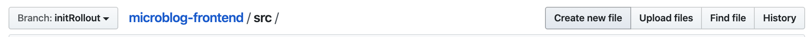
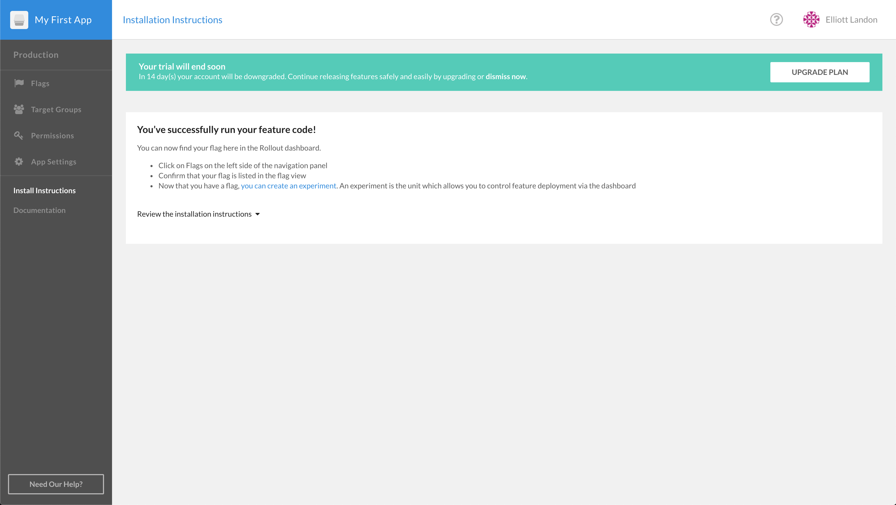

#  CloudBees Rollout Workshop Setup

## CloudBees Rollout Set-Up
In this lab, you will set up a CloudBees Rollout account and use it to manage feature flags through remote configurations created in the dashboard.

### Create a CloudBees Rollout Account

1. In a new tab, navigate to the CloudBees Rollout [sign-up URL](https://app.rollout.io/signup).
2. Fill out the form with your name, email, and created password. After confirming your password,  check the box agreeing to Rollout's Terms of Service (which can be viewed [here](https://docs.cloudbees.com/docs/cloudbees-common/latest/subscription-agreement/)).
3. In order to control feature flags from the Rollout dashboard, we have to add the `<ROLLOUT_ENV_KEY>` to our microblog code. On the far left side of the dashboard, click the **App Settings** panel. From the resulting page, select the **Environments** tab.
4. Click to copy your unique `<ROLLOUT_ENV_KEY>` associated with the Production environment and paste it in a notepad for future reference.
5. Click **Add New Environment** and name it Development.
6. CLick to copy your unique `<ROLLOUT_ENV_KEY>` associated with the Development environment and paste it in a notepad for later.


### Environment Vairable

1. In Github, navigate to the microblog-frontend repository previously forked to the organization.
2. Ensure you are on the `master branch`. Click the `.env.production` file.
3. Select the pencil icon to edit the file. On line 1, paste your _Production_ `<ROLLOUT_ENV_KEY>` _after_ the equals sign(=). Ensure the key is surrounded by 'single quotes', as seen below.
4. Commit the file to the `master` branch.
5. Click `Branch: master`, and select `development` to switch branches.
6. Now within the `development` branch, click the `.env.development` file. Select the pencil icon on the following page to edit the file. Then, paste your _Development_ `<Rollout_ENV_KEY>` after the equals sign on line 1. Ensure it surrounded by 'single quotes'.
7. Commit the file directly to the `development` branch.

<p>

### Create Rollout Feature Flags

* The `flags.js` file defines the feature flags that our application will use and then registers those flags for remote configuration via a `setup` call to the dashboard.
*

1. Ensure you are on the `development` branch at the root of the microblog-frontend repository.
2. Navigate to `src\utils\flags.js` by clicking the `src` folder, followed by the `utils` folder, then the `flag.js` file.
3. Click the pencil to edit the `flags.js` file. Define the `flagEnabled` toggle by adding the following within the `const Flag` section:
```javascript
export const Flags = {
	sidebar: new Rox.Flag(false),
	flagEnabled: new Rox.Flag(false)
};
```

**The `flags.js` should be**
<details><summary>this:</summary>

```javascript
import Rox from 'rox-browser'

export const Flags = {
  sidebar: new Rox.Flag(false),
  flagEnabled: new Rox.Flag(false)
};

const options = {
};

Rox.register('default', Flags);
Rox.setup("<ROLLOUT_ENV_KEY>", options);
	
```
</details>

4. Commit the changes by adding a comment (e.g. "added flagEnabled flag"), and select the **Commit directly to the development branch** radio button, before clicking **Commit changes**.

### Adding .vuejs

1. At root of `development` branch, click **Create a new file** button.
2. Name your file `.vuejs` (don't forget leading period)
3. Leave the file blank, commit the file by adding a comment (e.g. "New .vuejs file"). Ensure the **Commit directly to the `development` branch** radio button is enabled, the click **Commit new file**.
Type `initRollout` then click **"Create branch: initRollout from development"** to finish creating a new branch.

### Checking
1. Navigate to CloudBees Core.
2. Navigate to `microblog-frontend`
3. Open Blue Ocean
4. Click `development` branch to see the pipeline.
5. Click deploy, and the last shell script


<p>

4. Ensure you are within the `development` branch, then navigate to `src/utils/` directory by clicking `src` then `utils`.

<p>

5. 
<p>

6. In this file, you need to import the Rollout library, create a feature flag for a sidebar element, then setup the connection to the dashboard using the `<ROLLOUT_ENV_KEY>`. To do this, type the follow snippet within the Github code editor. Make sure that you replace `<ROLLOUT_ENV_KEY>` with your unique key copied earlier.
```javascript
import Rox from 'rox-browser'

export const Flags = {
	sidebar: new Rox.Flag(false)
};

Rox.register('default', Flags);

Rox.setup("<ROLLOUT_ENV_KEY>");
```
7. Create a commit message (e.g. Create flag.js) and select **Commit directly to the `initRollout` branch** radio button. The file and its directory path should look similar to the picture below. Then click **Commit new file**.

<p>

8. **Need to edit** Create a pull request from initSidebar to `Development` branch. Merge.

9. **Need to edit** Open the URL produced from the Core Development branch job.

10. Navigate to the Rollout Dashboard, and click **Install Instructions** panel on the left. A succesful connection message should be displayed like the one below.

<p>

11. **For instructor led workshops please return to the [workshop slides](https://cloudbees-days.github.io/core-rollout-flow-workshop/rollout/#1).**

Otherwise, you may proceed to the next lab: [**Gating a Component with a CloudBees Feature Flag**](../rolloutFeature/rolloutFeature.md) or choose another lab on the [main page](../../README.md#workshop-labs).

