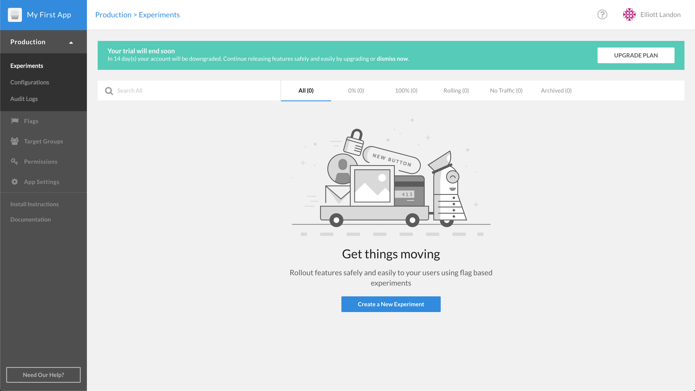

## Control the Value of a Feature Flag
1. Navigate to the Rollout Dashboard.
2. On the left-hand side of the screen, click Production, and then Experiments from the expanded list. Then, click "Create a New Experiment" button.

4. In the pop-up, ensure the "default.sidebar" flag is selected from the drop-down menu before clicking "Set Audience."

5. Right now, the sidebar is not shown because the value of the feature flag is set to `False` by default. We can now change the value to true. Click on the drop-down menu next to then and select True.
6. Click Update Audience.
7. Navigate back to the micro-blog and see that the sidebar is now visible.
8. Next lab link.