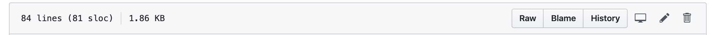

## Adding a Sidebar to the Microblog
1. In Github, navigate to the root directory of the microblog-frontend repository.
2. Click `Branch: initRollout`
3. Type `newSidebar` then click "Create branch: newSidebar from initRollout" to finish creating a new branch.
4. Ensure you are within the newSidebar branch, then navigate to the `src/views/Posts.vue` file by clicking the `src`, `views`, and `Posts.vue` links, consecutively.
<p>

5. Click the pencil icon to edit the file.
<p>

5. First let's import the Rollout library. On line 28, add the following statement:
```javascript
import { Flags } from '../utils/flags'
```
6. We are going to create a function called `show_sidebar` whose return value is defined by the boolean value associated with our `sidebar` feature flag. To declare the `show_sidebar` function and relate it to the value of our previously created feature flag, add it to the end of the `data: function ()` block starting at line 34 (DON'T FORGET TO ADD A COMMA AFTER THE `errors` function):
```javascript
data: function () {
  return {
    message: '',
    posts: [],
    users: [],
    errors: [],
    show_sidebar: Flags.sidebar.isEnabled()
  }
},
```
7. Now we're going to add a sidebar component that is gated behind our previously declared sidebar feature flag. In line 6, make the following edits:
```html
 <h1 class="title">Posts <span v-if="show_sidebar"> - Show sidebar!</span></h1>
```
8. Add a new line between lines 7 and 8 and insert the following code that implements the new sidebar functionality:
```html
  <div class="columns" v-if="show_sidebar">
    <div class="box column is-three-quarters">
      <div class="box">
        <b-field label="What's going on today?"
          class="is-marginless"
        >
          <b-input v-model="message" maxlength="140" type="textarea"/>
        </b-field>
          <b-button type="is-dark" @click="addPost">Submit</b-button>
      </div>
      <hr class="hr">
      <Post v-for="post in posts" :key="post.id" :post="post"/>
    </div>
    <div class="box column">
      <h3 class="is-size-4 has-text-weight-bold">Users list</h3>
      <ul>
        <li v-for="user in users" :key="user.url">
          <a :href="user.url">{{user.username}}</a>
        </li>
      </ul>
    </div>
  </div>
```
9. The last thing we need to do is gate the current "What's going on today?" behind an else statement. We can accomplish this with one v-else edit to remaining of the html:
```html
  <div class="box" v-else>
    <div class="box">
      <b-field label="What's going on today?"
                   class="is-marginless"
      >
        <b-input v-model="message" maxlength="140" type="textarea"/>
      </b-field>
      <b-button type="is-dark" @click="addPost">Submit</b-button>
      </div>
      <hr class="hr">
        <Post v-for="post in posts" :key="post.id" :post="post"/>
    </div>
  </div>
```
10. Create a commit message and select "Commit directly to the sidebar branch." option before clicking "Commit new file.""