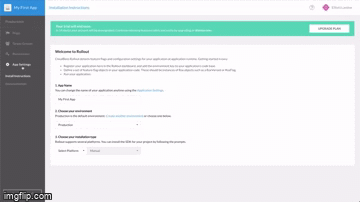
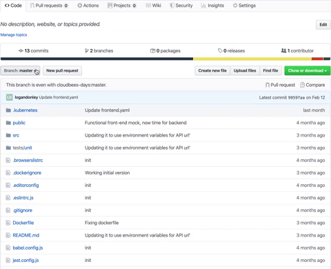

## Create a Rollout Account
1. Navigate to the CloudBees Rollout [sign-up](https://app.rollout.io/signup).
2. Fill out the form, agree to the Terms of Service, and click Sign Up.
3. In order to control feature flags from the Rollout dashboard, we have to connect it to our code. On the far left side of the dashobard, click the App Settings option. From the resulting App Settings page, navigate to the "Environments" tab, and copy your unique key associated with the Production environment. This will be the <ROLLOUT_ENV_KEY> used in our set-up later on.
<p>
<p>

4. In Github, navigate to the microblog-frontend repository previously forked to the organization.
5. Click `Branch: master`
6. Type "initRollout" to create a new branch.
<p>
	
7. Click "Create a new file"
8. Type "utils/flag.js"
9. Within the Github code editor, enter the following code:
```javascript
import Rox from 'rox-browser'

export const Flags = {
	sidebar: new Rox.Flag(false)
};

Rox.register('default', Flags);

Rox.setup("<ROLLOUT_ENV_KEY>");
```
10. Create a commit message and select "Commit directly to the initRollout branch." option before clicking "Commit new file.""